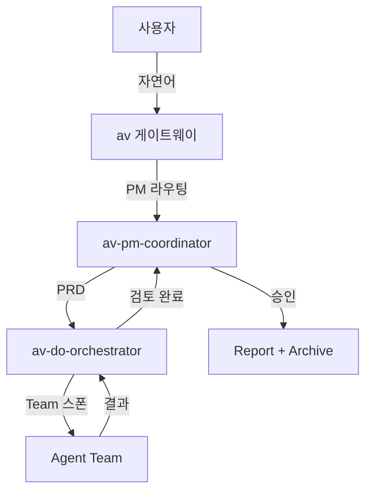

# av-util-mermaid-std — Mermaid 다이어그램 표준

> av 생태계 문서에서 Mermaid 다이어그램을 사용할 때의 표준 규칙.

## 1. 허용 다이어그램 유형

| 유형 | 용도 |
|------|------|
| `flowchart TD` | 워크플로우, 의사결정 흐름 |
| `sequenceDiagram` | 에이전트 간 통신, API 호출 |
| `classDiagram` | 데이터 모델, 컴포넌트 관계 |
| `stateDiagram-v2` | 상태 전이 (PDCA 등) |
| `erDiagram` | 엔티티 관계 |

## 2. 스타일 규칙

- 노드 텍스트는 **한국어** 우선 (영어 병기 가능)
- 최대 깊이: 4레벨
- 최대 노드: 20개 (초과 시 분할)
- 색상: Mermaid 기본 테마 사용 (커스텀 CSS 금지)

## 3. 조직 흐름 표준

