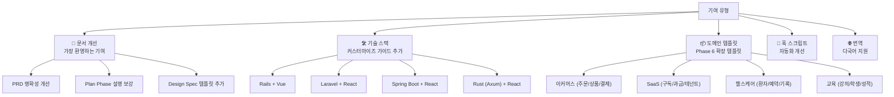
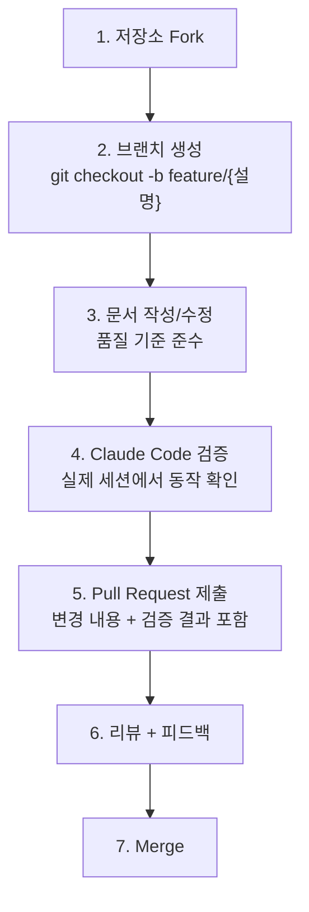
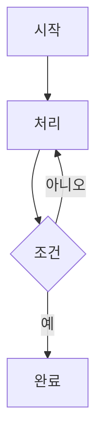

# AutoVibe 기여 가이드

> AutoVibe 프로젝트에 기여해 주셔서 감사합니다!
> 이 가이드는 기여 방법, 문서 품질 기준, PR 프로세스를 설명합니다.

---

## 기여 유형



---

## PR 제출 프로세스



### 브랜치 네이밍 규칙

```
feature/{설명}    → 신규 기능/문서 추가
fix/{설명}        → 오류 수정
docs/{설명}       → 문서만 변경
translate/{언어}  → 번역

예시:
  feature/rails-stack-guide
  fix/phase3-forge-order
  docs/improve-phase0-description
  translate/japanese
```

---

## 문서 품질 기준

AutoVibe 문서는 **Claude Code가 읽고 실행할 수 있어야** 합니다.

### 필수 요건

| 기준 | 설명 | 예시 |
|------|------|------|
| **실행 가능성** | Claude Code가 문서를 읽고 즉시 파일을 생성 가능해야 함 | 파일 경로·내용 명시 |
| **스택 독립성** | Base Tier 문서는 특정 프레임워크 가정 금지 | `{{TECH_STACK}}` 플레이스홀더 |
| **AskUserQuestion 표시** | Claude가 사용자에게 물어봐야 할 지점 명확히 표시 | `AskUserQuestion:` 태그 |
| **파일 템플릿** | `{{PLACEHOLDER}}` 형식 변수를 포함한 완전한 파일 내용 |  |
| **검증 단계** | 각 Phase 완료 후 검증 방법 포함 | 명령어 + 기대 출력 |

### Mermaid 다이어그램 작성 기준

모든 도식은 GitHub에서 렌더링 가능한 Mermaid를 사용합니다:

````markdown

````

**지원하는 다이어그램 유형:**
- `flowchart` (TD: 위→아래, LR: 좌→우) — 프로세스 흐름
- `sequenceDiagram` — 시스템 간 상호작용
- `graph` — 계층 구조·관계도
- `gitGraph` — 브랜치 전략

**주의사항:**
- 노드 텍스트에 `<br/>` 태그로 줄바꿈 (역슬래시 `\n` 사용 금지)
- 노드 텍스트에 따옴표 포함 시 `["{텍스트}"]` 형식 사용

---

## 기술 스택 가이드 작성 방법

### 커스터마이즈 가이드 구조

새 기술 스택 커스터마이즈 가이드는 다음 항목을 포함해야 합니다:

```markdown
## {스택명} 커스터마이즈

### av-base-auditor 체크 3 설정
{스택에 맞는 코드 품질 규칙}

### av-base-code-quality 빌드 명령어
{빌드·lint·테스트 명령어}

### av-bash-guard 금지 패턴
{스택 특화 위험 패턴}

### 에이전트 scope 패턴
{파일 접근 범위 패턴}

### 예시 ROUTING_TABLE 항목
{도메인 라우팅 규칙}
```

### 검증 방법

새 스택 가이드를 제출하기 전, 실제 Claude Code 세션에서 동작을 확인해야 합니다:

1. 해당 스택으로 새 프로젝트 생성
2. AutoVibe Phase 0~5를 해당 스택 가이드로 실행
3. `/av-vibe-forge health` 결과 캡처 (90점 이상)
4. Phase 6에서 도메인 에이전트 1개 생성 테스트

---

## 도메인 템플릿 기여 방법

Phase 6 도메인 확장 템플릿은 `docs/design/av-ecosystem-design-spec.md`의 §10 시나리오 형식을 따릅니다.

### 템플릿 포함 항목

```markdown
### {도메인명} 도메인 확장 시나리오

**적합한 프로젝트**: {설명}

**생성할 컴포넌트**:
- av-{domain}-lead (Lead 에이전트)
- av-{domain}-backend (백엔드 에이전트)
- av-{domain}-impl (구현 스킬)

**Claude 실행 명령어 시퀀스**:
/av-pm start {domain}-agents
→ AskUserQuestion 질문 예시: ...
→ /av-vibe-forge agent ...
→ ROUTING_TABLE 추가 경로: ...

**검증 방법**:
/av run "{도메인 특화 자연어}" → 기대 라우팅 결과
```

---

## 번역 기여

AutoVibe 문서는 다국어 지원을 목표로 합니다.

### 번역 대상 파일 우선순위

| 우선순위 | 파일 | 이유 |
|---------|------|------|
| 1 | `README.md` | 가장 많이 읽히는 파일 |
| 2 | `guides/getting-started.md` | 실제 사용 가이드 |
| 3 | `guides/bkit-integration.md` | 설치 가이드 |
| 4 | 나머지 가이드 | 심화 내용 |

### 번역 파일 위치

```
{언어코드}/
├── README.md
└── guides/
    ├── getting-started.md
    └── bkit-integration.md
```

예: `en/README.md`, `ja/README.md`, `zh-CN/README.md`

---

## 행동 강령

- 모든 커뮤니케이션에서 존중과 건설적인 태도 유지
- 문서 품질 개선에 집중 (개인적 비판 금지)
- 실제 Claude Code 세션에서 테스트한 내용만 기여
- 다른 기여자의 작업을 존중하고 피드백은 구체적으로

---

## 질문이 있으신가요?

`question` 라벨로 Issue를 열어주세요.
