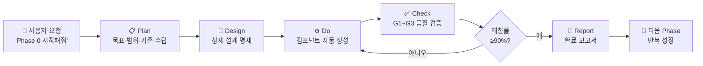
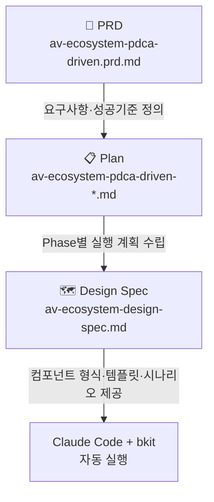
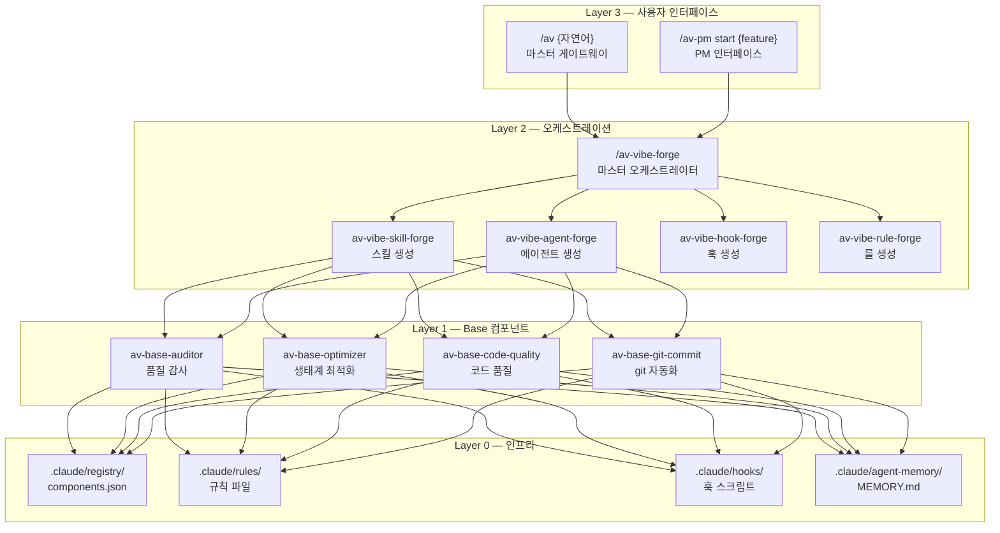
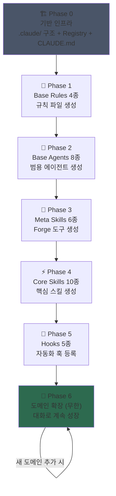
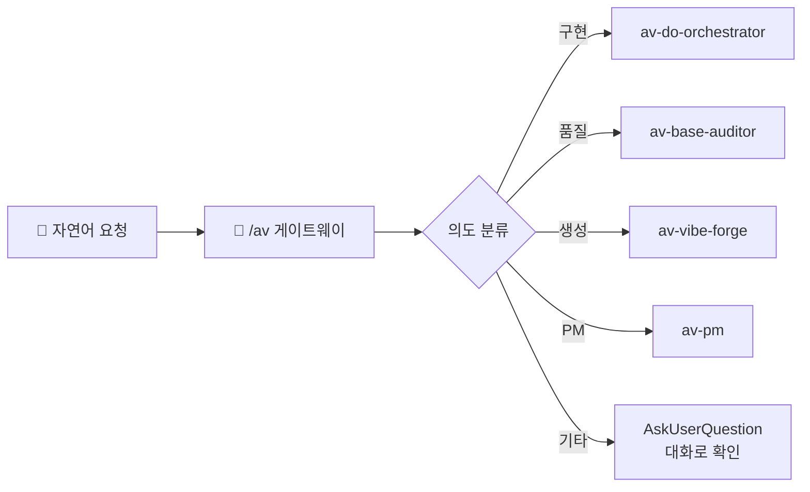
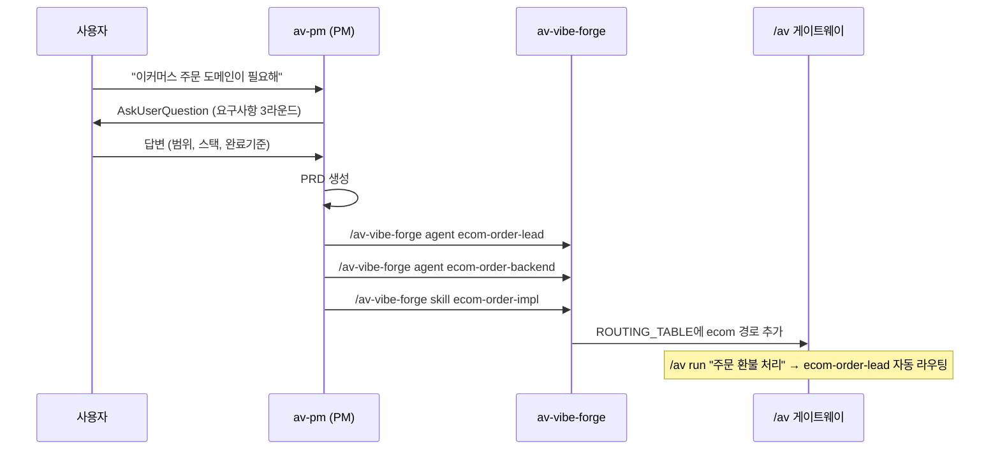

# AutoVibe

> **AI 네이티브 자기 성장형 개발 생태계**
> 파일 복사 없이, 대화만으로 나만의 AI 에이전트 생태계를 만드세요.

[](https://opensource.org/licenses/MIT)
[](https://claude.ai/code)
[](#사전-요구사항)

---

## AutoVibe란?

AutoVibe는 **Claude Code + bkit PDCA** 위에서 동작하는 AI 에이전트 생태계 프레임워크입니다.

기존 방식은 설정 파일을 복사하고 수작업으로 설정을 맞추는 번거로운 작업이 필요했습니다.
AutoVibe는 다릅니다. **사용자와 Claude의 대화**를 통해 프로젝트에 꼭 맞는 생태계가 점진적으로 성장합니다.

```
기존 방식:  .claude/ 파일 복사 → 수작업 설정 → 오류 수정 → 반복...
AutoVibe:   Claude에게 말하기 → 대화로 설계 → 자동 생성 → 점진적 성장
```

---

## 핵심 개념: PDCA 기반 점진적 성장



각 Phase는 독립적인 PDCA 사이클로 실행됩니다. 실패해도 해당 Phase만 재시도하면 됩니다.

---

## 3개 핵심 문서로 동작합니다

AutoVibe는 Claude Code가 읽고 실행할 수 있는 3개의 문서로 구성됩니다:



| 문서 | 역할 | 주요 내용 |
|------|------|---------|
| **PRD** | 무엇을 만들 것인가 | 요구사항, 컴포넌트 인벤토리, 성공 기준 |
| **Plan** | 어떤 순서로 만들 것인가 | Phase 0~6 실행 계획, bkit 명령어 |
| **Design Spec** | 어떻게 만들 것인가 | 파일 형식 템플릿, 실행 시나리오, 기술 스택 가이드 |

---

## 생태계 아키텍처



---

## Phase별 구축 계획



| Phase | 목표 | 생성 컴포넌트 수 | 누적 합계 |
|-------|------|:--------------:|:--------:|
| **0** | 기반 인프라 (.claude/ 구조) | 5개 파일 | 5 |
| **1** | Base Rules | 4개 Rule | 9 |
| **2** | Base Agents | 8개 Agent | 17 |
| **3** | Meta Skills / Forge | 6개 Skill | 23 |
| **4** | Core Skills | 10개 Skill | 33 |
| **5** | Hooks & Settings | 5개 Hook | 38 |
| **6** | 도메인 확장 | 무제한 | ∞ |

---

## 완성 후 주요 기능

### `/av {자연어}` — 지능형 라우팅 게이트웨이

자연어로 말하면 Claude가 최적의 에이전트/스킬을 자동으로 선택합니다.

```
사용자: "주문 관리 백엔드 API 구현해줘"
→ Claude: ecom-order-backend 에이전트로 라우팅

사용자: "코드 품질 검사해줘"
→ Claude: av-base-auditor Level 2 실행

사용자: "새 결제 도메인 에이전트 만들어줘"
→ Claude: /av-vibe-forge agent payment-lead 실행
```



### `/av-pm start {feature}` — PM 대화형 인터페이스

새 기능 개발을 PM처럼 체계적으로 시작합니다.

```
사용자: "주문 환불 기능이 필요해"

Claude (PM 역할):
  1. 3라운드 질문으로 요구사항 파악
     - "어떤 환불 정책이 필요한가요?"
     - "백엔드만? 아니면 UI도 필요한가요?"
     - "완료 기준은 무엇인가요?"
  2. PRD 문서 자동 생성
  3. 전담 에이전트 팀 구성 (Lead + Backend + Frontend)
  4. 병렬 구현 시작 (isolation:worktree)
```

### `/av-vibe-forge` — 생태계 관리 오케스트레이터

| 명령어 | 역할 |
|--------|------|
| `/av-vibe-forge skill {name}` | 새 스킬 생성 + 레지스트리 자동 등록 |
| `/av-vibe-forge agent {name}` | 새 에이전트 생성 + MEMORY.md 초기화 |
| `/av-vibe-forge hook PostToolUse {name}` | 훅 스크립트 생성 + settings.json 등록 |
| `/av-vibe-forge rule {name}` | 규칙 파일 생성 + 레지스트리 등록 |
| `/av-vibe-forge health` | 생태계 건강도 0~100점 보고서 |
| `/av-vibe-forge list` | 전체 컴포넌트 목록 |
| `/av-vibe-forge validate` | 파일 무결성 검증 |

---

## Phase 6: 도메인 확장 — 무한 성장

기반 생태계 구축 후, 대화만으로 도메인 에이전트를 계속 추가할 수 있습니다.



---

## 기술 스택 호환성

AutoVibe는 특정 기술 스택에 종속되지 않습니다. Design Spec에 주요 스택별 커스터마이즈 가이드가 포함되어 있습니다.

| 기술 스택 | 빌드 도구 | 품질 도구 | 에이전트 스코프 |
|-----------|---------|---------|--------------|
| NestJS + Next.js | pnpm + turbo | Biome | `src/**/*.ts` |
| FastAPI + React | uv + vite | Ruff + mypy | `**/*.py`, `src/**/*.tsx` |
| Django + React | pip + webpack | flake8 + ESLint | `**/*.py`, `frontend/**` |
| Go + React | go build | golint + ESLint | `**/*.go`, `web/**` |
| Rails + Vue | bundler + vite | RuboCop + ESLint | `**/*.rb`, `app/javascript/**` |

---

## 네이밍 컨벤션

모든 AutoVibe 컴포넌트는 엄격한 네이밍 규칙을 따릅니다:

```
av-{도메인}-{이름}
 │    │        └─ kebab-case, 최대 4단어
 │    └─ base (범용필수) | vibe (메타) | util (범용선택) | {프로젝트명} (특화)
 └─ AutoVibe 생태계 마커 (필수)

예시:
  av-base-auditor       → base 도메인, 감사 에이전트
  av-vibe-forge         → vibe 도메인, forge 오케스트레이터
  av-base-code-quality  → base 도메인, 코드 품질 스킬
  av-ecom-order-lead    → ecom 도메인, 주문 Lead 에이전트
```

---

## 프로젝트 구조

```
autovibe/
├── README.md                                    ← 이 문서
├── LICENSE                                      ← MIT 라이선스
├── CONTRIBUTING.md                              ← 기여 가이드
├── docs/
│   ├── prd/
│   │   └── av-ecosystem-pdca-driven.prd.md      ← 요구사항 정의서
│   ├── plan/
│   │   └── av-ecosystem-pdca-driven-*.md        ← PDCA Phase 계획서
│   └── design/
│       └── av-ecosystem-design-spec.md           ← 완전 구현 명세서
└── guides/
    ├── getting-started.md                       ← Phase별 시작 가이드
    ├── bkit-integration.md                      ← bkit 플러그인 연동 가이드
    └── cc-official-docs.md                      ← Claude Code 공식 문서 참조
```

---

## 빠른 시작

### 사전 요구사항

| 도구 | 버전 | 확인 방법 |
|------|------|---------|
| Claude Code CLI | v2.1.71+ | `claude --version` |
| bkit 플러그인 | 최신 | `/bkit` (Claude Code 내) |
| git | 2.x+ | `git --version` |

### 3단계 시작

```bash
# 1단계: AutoVibe 문서 내 프로젝트로 복사
git clone https://github.com/{your-org}/autovibe.git
mkdir -p my-project/docs/autovibe
cp -r autovibe/docs my-project/docs/autovibe/

# 2단계: 프로젝트에서 Claude Code 실행
cd my-project
claude

# 3단계: Claude에게 다음과 같이 말하세요
```

Claude에게 전달할 메시지:
```
docs/autovibe/design/av-ecosystem-design-spec.md 를 참고해서
bkit PDCA로 AutoVibe 생태계를 Phase 0부터 시작해서 구축해줘.
```

자세한 단계별 가이드는 [guides/getting-started.md](guides/getting-started.md)를 참고하세요.

---

## 핵심 원칙

| 원칙 | 설명 |
|------|------|
| **대화 우선** | 모든 컴포넌트는 스크립트가 아닌 대화로 생성 |
| **PDCA 사이클** | Plan → Design → Do → Check → Report 반복 |
| **점진적 성장** | Phase 0~2 소규모 시작 → Phase 6+ 무한 확장 |
| **스택 무관** | 어떤 기술 스택에도 커스터마이즈 적용 가능 |
| **자기 학습** | 각 에이전트/스킬의 MEMORY.md가 시간이 지날수록 개선 |

---

## 기여하기

[CONTRIBUTING.md](CONTRIBUTING.md)를 참고하세요.

주요 기여 영역:
- 신규 기술 스택 커스터마이즈 가이드 (Rails, Laravel, Spring Boot 등)
- 도메인별 Phase 6 템플릿 (이커머스, SaaS, 헬스케어 등)
- 훅 스크립트 개선
- 번역 (영어, 일본어, 중국어 등)

---

## 라이선스

MIT License — [LICENSE](LICENSE) 참조

---

## 기반 기술

- [Claude Code](https://claude.ai/code) by Anthropic
- [bkit](https://github.com/anthropics/claude-code) PDCA 플러그인
- PDCA 방법론 (Plan-Do-Check-Act)
