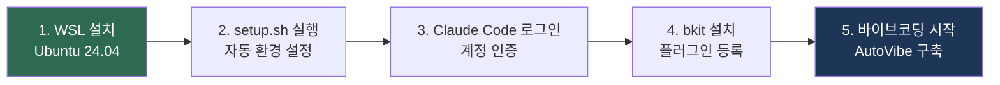
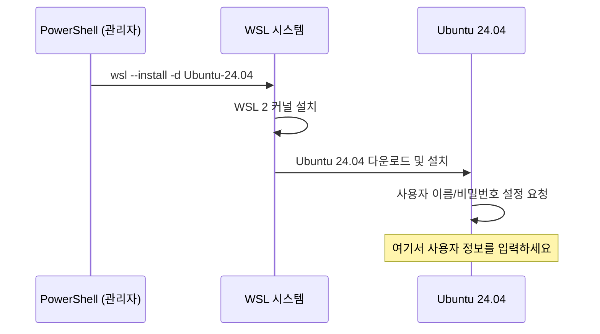
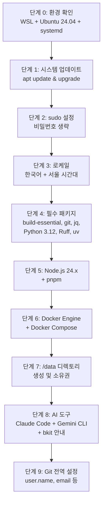
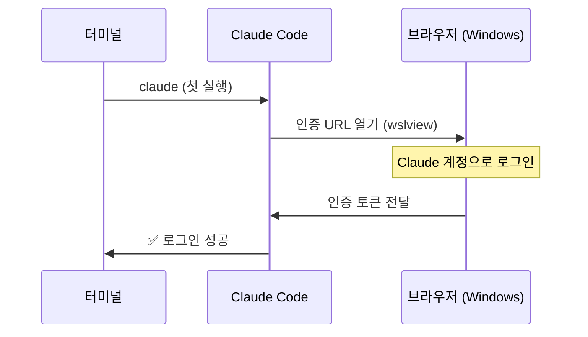

# 00. WSL 바이브코딩 환경 설정 가이드

> **대상**: Windows 11 사용자 (WSL 미설치 포함)
> **결과**: WSL Ubuntu 24.04 + Claude Code + bkit 개발환경 완성
> **소요 시간**: 20~30분

---

## 전체 설정 흐름



---

## 1. 시작 전 확인

| 항목 | 요구사항 | 확인 방법 |
|------|----------|----------|
| Windows | 11 (Build 22000+) | `winver` |
| RAM | 32GB 이상 권장 | 작업관리자 |
| 저장공간 | 500GB 이상 여유 | 파일탐색기 |
| 계정 | Claude Pro / Max / Teams / Enterprise | https://claude.com/pricing |

> 무료 플랜은 Claude Code를 사용할 수 없습니다.

### WSL 버전 확인 (이미 설치된 경우)

PowerShell에서:
```powershell
wsl --version
# WSL 버전: 2.x.x 필요. 구버전이면:
wsl --update
```

---

## 2. WSL + Ubuntu 24.04 설치

**Windows PowerShell을 관리자 권한으로 실행** 후:

```powershell
wsl --install -d Ubuntu-24.04
```



설치 완료 후 Ubuntu 24.04 앱이 열리면 **사용자 이름과 비밀번호**를 설정합니다.

---

## 3. 자동 환경 설정 (setup.sh)

Ubuntu 터미널에서:

```bash
cd /data/autovibe/wsl-setup
chmod +x setup.sh
./setup.sh
```

### setup.sh가 자동으로 설치하는 항목



설치 완료 후 Docker 그룹 적용:
```bash
newgrp docker
# 또는 Ubuntu 24.04 앱을 닫고 재시작
```

---

## 4. Claude Code 로그인

```bash
source ~/.bashrc   # PATH 반영
cd ~/              # 작업 디렉토리
claude             # 첫 실행
```



> **WSL에서 브라우저가 안 열리면**: 터미널에 출력된 URL을 Windows 브라우저에 직접 붙여넣으세요.

```bash
claude --version   # 버전 확인 (v2.1.71 이상)
claude doctor      # 환경 진단
```

---

## 5. bkit 플러그인 설치

bkit은 Claude Code 내부 명령어로만 설치 가능합니다.

```bash
cd ~/your-project
claude
```

**Claude Code 프롬프트에서 순서대로 입력:**

```
# Step 1: Marketplace 등록
/plugin marketplace add popup-studio-ai/bkit-claude-code

# Step 2: bkit 설치
/plugin install bkit

# Step 3: 설치 확인
/bkit
```

bkit 메뉴가 표시되면 설치 성공입니다.

---

## 6. 바이브코딩 시작

```bash
cd /data/your-project
claude
```

AutoVibe 생태계 구축을 시작하려면: [01-퀵스타트-30분.md](01-퀵스타트-30분.md)

---

## 문제 해결

### Ubuntu 버전이 24.04가 아님

```powershell
# PowerShell: 기존 배포판 삭제 후 재설치
wsl --unregister Ubuntu
wsl --install -d Ubuntu-24.04
```

### 브라우저가 열리지 않음

```bash
sudo add-apt-repository universe -y
sudo apt update && sudo apt install -y wslu
echo 'export BROWSER="wslview"' >> ~/.bashrc
source ~/.bashrc
```

### Claude Code 설치/업데이트 실패

```bash
claude doctor
claude update
curl -fsSL https://claude.ai/install.sh | bash
```

### Docker 서비스 미시작

```bash
# /etc/wsl.conf 확인
cat /etc/wsl.conf
```

아래 내용 없으면 추가:
```bash
sudo tee /etc/wsl.conf << 'EOF'
[boot]
systemd=true
EOF
```

PowerShell에서 WSL 재시작:
```powershell
wsl --shutdown
wsl -d Ubuntu-24.04
```

---

## 참고 링크

| 리소스 | URL |
|--------|-----|
| Claude Code 공식 문서 | https://code.claude.com/docs/en/overview |
| Claude 구독 | https://claude.com/pricing |
| bkit 플러그인 | https://github.com/popup-studio-ai/bkit-claude-code |
| Microsoft WSL 문서 | https://learn.microsoft.com/ko-kr/windows/wsl/ |

---

**다음**: [01-퀵스타트-30분.md](01-퀵스타트-30분.md) -- 30분 안에 AutoVibe Phase 0 완료
