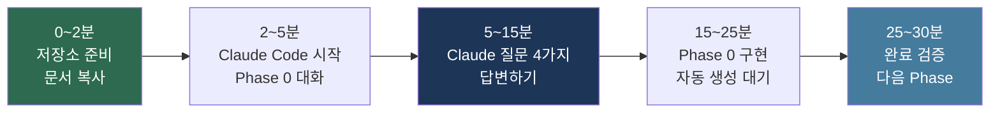
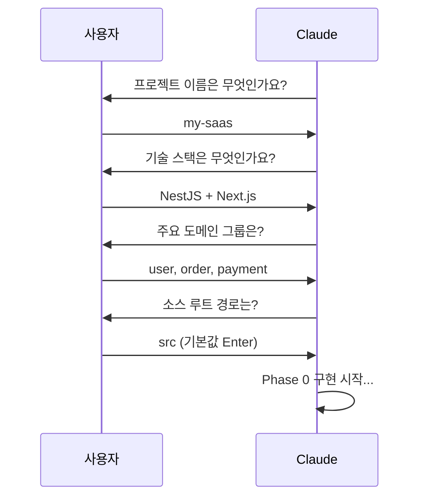
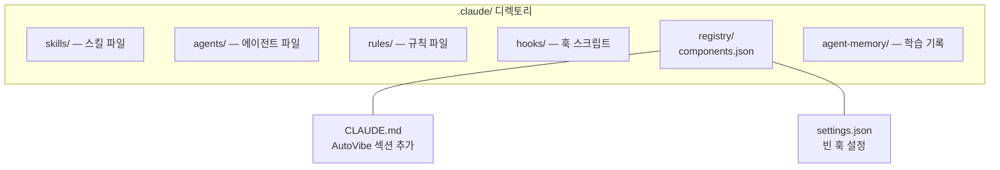
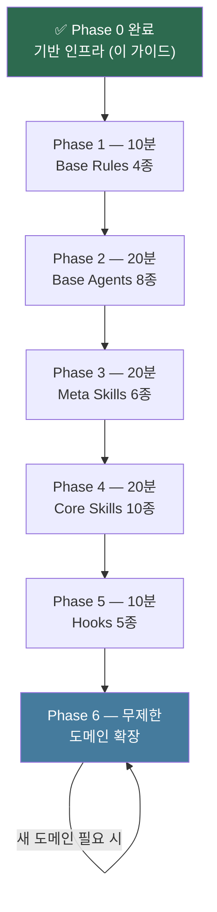

# 01. AutoVibe 30분 퀵스타트

> **목표**: 이 가이드를 따라 30분 안에 Phase 0 기반 인프라를 완료합니다.
> AutoVibe를 처음 접하는 분을 위한 단계별 타임라인입니다.

---

## 전체 흐름



---

## AutoVibe 생태계란

AutoVibe는 **4개의 독립 플랫폼**을 하나로 통합하는 AI 개발 생태계입니다.

| 플랫폼 | 역할 | 비유 |
|--------|------|------|
| **Claude Code** | AI 런타임 엔진 — 에이전트가 생각하고 코드를 만듦 (Opus 4.7, 1M context) | 개발팀의 두뇌 |
| **gstack** | Fast Headless Browser — 만든 것을 눈으로 보고 테스트 | 개발팀의 눈 |
| **bkit** | Vibecoding Kit — 설계 대비 품질을 측정하고 개선 | 개발팀의 체크리스트 |
| **GitNexus** | 공유 코드 그래프 MCP — 임팩트·컨텍스트·라우트맵 | 개발팀의 지도 |

이 4축을 `/av {자연어}` 하나로 제어합니다. 30분 안에 기반을 구축해 봅시다.

---

## 시작 전 확인 (2분)

```bash
claude --version    # v2.2 이상 권장 (Opus 4.7 / deferred tools)
git --version       # git 2.x 이상
docker --version    # 28.x (GitNexus 의존)
```

Claude Code 내에서 4축 확인:
```
/bkit          # bkit 메뉴 (PDCA · 코드분석 · gap)
/gstack        # gstack 메뉴 (29개 명령)
/av            # AutoVibe 마스터 게이트웨이
```

CLI에서 GitNexus MCP 확인:
```bash
claude mcp list 2>/dev/null | grep gitnexus
# 기대 출력: gitnexus: /home/.../gitnexus mcp - ✓ Connected
```

네 가지가 모두 정상이면 준비 완료. 누락이 있으면 [00-WSL-환경설정.md](00-WSL-환경설정.md) 참고.

---

## 0:00~2:00 -- 저장소 준비

```bash
# AutoVibe 저장소 클론
git clone https://github.com/s99606931/autovibe.git /tmp/autovibe

# 내 프로젝트로 이동
cd my-project

# AutoVibe 문서 복사
mkdir -p docs/autovibe
cp -r /tmp/autovibe/docs/* docs/autovibe/
cp -r /tmp/autovibe/guides docs/autovibe/guides
```

---

## 2:00~5:00 -- Claude Code 시작

```bash
cd my-project
claude
```

Claude에게 입력:
```
AutoVibe 생태계를 구축하고 싶어. Phase 0부터 시작해줘.
docs/autovibe/design/av-ecosystem-design-spec.md 를 참고해서.
```

---

## 5:00~15:00 -- Claude의 질문에 답하기



| 질문 | 예시 답변 | 비고 |
|------|---------|------|
| "프로젝트 이름은?" | `my-saas` | 영문 소문자, 하이픈 가능 |
| "기술 스택은?" | `NestJS + Next.js` | 백엔드 + 프론트엔드 |
| "주요 도메인은?" | `user, order, payment` | 콤마 구분 |
| "소스 루트 경로는?" | `src` | 기본값 Enter 가능 |

---

## 15:00~25:00 -- Phase 0 구현 완료 대기

Claude가 자동으로 생성하는 것들:



---

## 25:00~30:00 -- 완료 검증

```bash
ls -la .claude/                              # 6개 하위 디렉토리
cat .claude/registry/components.json         # 기본 구조
grep -A 5 "AutoVibe" CLAUDE.md               # AutoVibe 섹션
```

기대 결과:
- `.claude/` 하위 6개 디렉토리 존재
- `components.json` 기본 구조 (`_meta`, `rules`, `agents`, `skills`, `hooks`)
- `CLAUDE.md`에 AutoVibe 관련 섹션

---

## Phase 0 이후 -- 다음 단계



**총 기반 구축: 약 2시간**

---

## 문제 발생 시

| 증상 | 해결 |
|------|------|
| Claude가 AutoVibe를 모름 | `docs/autovibe/design/av-ecosystem-design-spec.md 파일을 읽어줘` |
| Phase 도중 멈춤 | `/pdca status` → 해당 Phase 재시작 |
| bkit을 찾을 수 없음 | Claude Code 재시작 또는 `/plugin install bkit` |

---

**다음**: [02-설계-철학.md](02-설계-철학.md) -- AutoVibe가 왜 이렇게 설계되었는지
