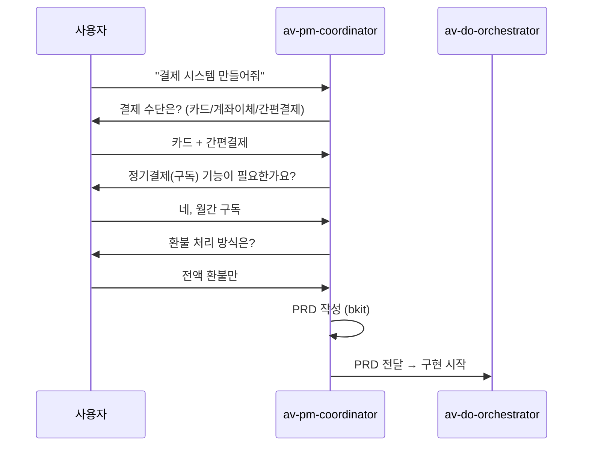
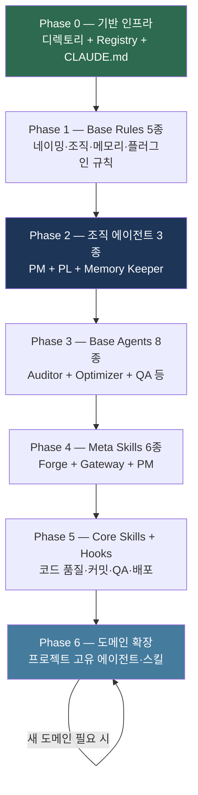
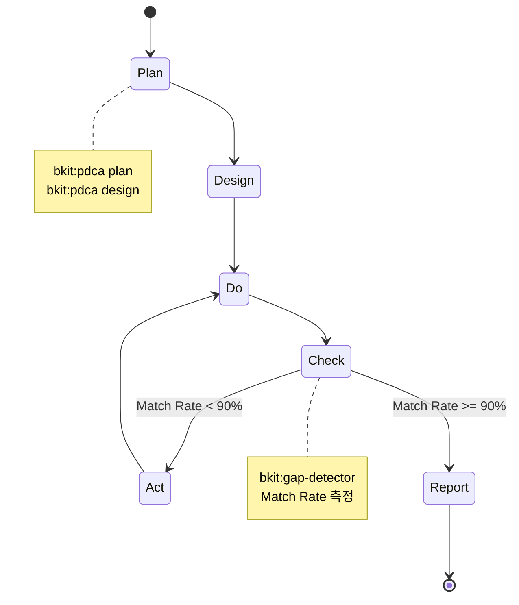
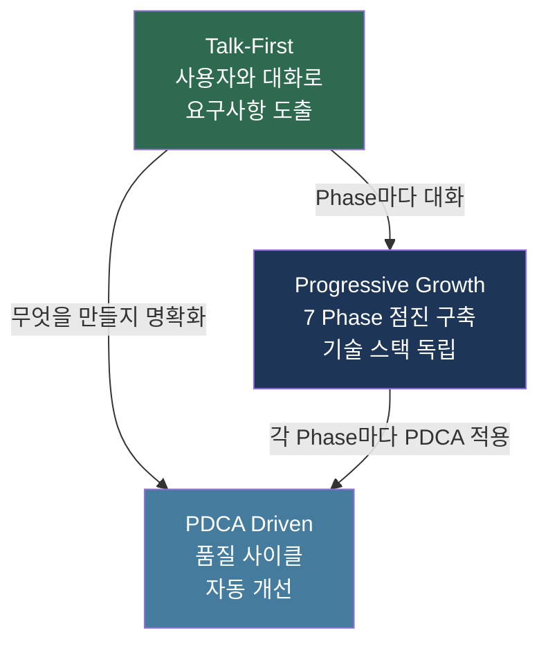

# 02. AutoVibe 설계 철학

> **목표**: AutoVibe가 왜 이렇게 설계되었는지 3가지 핵심 원칙을 이해합니다.
> **소요 시간**: 15분

---

## 3가지 핵심 원칙

---

## 원칙 1: Talk-First (대화가 먼저)

### 문제

기존 AI 코딩 도구는 "코드를 생성해줘"라는 명령어 중심입니다.
하지만 진짜 문제는 **무엇을 만들어야 하는지 모르는 것**입니다.

### 해결

AutoVibe는 코드 생성 전에 **PM 에이전트가 대화**를 합니다.

### 왜 중요한가

| 방식 | 결과 |
|------|------|
| 명령어 중심 | "결제 만들어줘" → 빠진 요구사항 → 나중에 재작업 |
| Talk-First | PM 질문 6개 → 명확한 PRD → 한 번에 올바른 구현 |

**핵심**: 사용자가 미처 생각하지 못한 것을 질문으로 끌어냅니다.

---

## 원칙 2: Progressive Growth (점진적 성장)

### 문제

AllSaaS 프로젝트에서 운영 중인 av 생태계는 에이전트 101개, 스킬 53개입니다.
이것을 한 번에 복사하면 **새 프로젝트에서 전혀 동작하지 않습니다**.

### 해결

7개 Phase로 나누어 **대화하면서 점진적으로 구축**합니다.

### 각 Phase마다 사용자와 대화

| Phase | Claude가 묻는 예시 |
|-------|--------------------|
| Phase 0 | "프로젝트 이름은?", "기술 스택은?" |
| Phase 1 | "조직 승인 프로세스가 필요한가요?" |
| Phase 2 | "PM 질문 최대 몇 개?", "기억에 무엇을 저장?" |
| Phase 4 | "어떤 스킬이 필요?", "자동 라우팅 규칙은?" |
| Phase 6 | "이 도메인의 핵심 엔티티는?" |

### 왜 중요한가

- **블랙박스 방지**: 각 Phase마다 사용자가 선택하므로 생태계를 이해합니다
- **기술 스택 독립**: 대화를 통해 NestJS든 Django든 맞춤 생성합니다
- **필요한 만큼만**: Phase 3까지만 해도 충분히 동작합니다

---

## 원칙 3: PDCA Driven (품질 보증 사이클)

### 문제

AI가 생성한 코드가 설계와 다르거나, 품질이 일정하지 않습니다.

### 해결

모든 작업이 **Plan → Do → Check → Act** 사이클을 따릅니다.

### PDCA와 플러그인 역할 분담

| PDCA 단계 | 플러그인 | 역할 |
|-----------|---------|------|
| **Plan** | bkit | PRD, Plan, Design 문서 작성 |
| **Do** | gstack | 실시간 구현 확인, 브라우저 프리뷰 |
| **Check** | bkit | 설계-구현 갭 분석 (Match Rate) |
| **Check** | gstack | 브라우저 E2E 테스트 |
| **Act** | bkit | 자동 개선 반복 (pdca-iterator) |
| **Report** | bkit | 완료 보고서, 학습 이력 |

### 왜 중요한가

- **측정 가능한 품질**: Match Rate 90% 이상이 완료 기준
- **자동 개선**: 90% 미만이면 자동 반복 개선 (최대 5회)
- **학습 축적**: 매 사이클마다 Memory Keeper가 패턴 저장

---

## 3가지 원칙의 연결

| 원칙 | 핵심 질문 | 답 |
|------|---------|-----|
| Talk-First | 무엇을 만들어야 하는가? | PM이 대화로 도출 |
| Progressive Growth | 어떻게 구축하는가? | 7 Phase 점진적 대화 |
| PDCA Driven | 품질을 어떻게 보장하는가? | Match Rate 90%+ 자동 사이클 |

---

## 비교: 기존 방식 vs AutoVibe

| 항목 | 기존 AI 코딩 | AutoVibe |
|------|-------------|----------|
| 시작점 | "코드 짜줘" | "결제 시스템 만들어줘" → PM 대화 |
| 구조 | 없음 또는 템플릿 복사 | 7 Phase 대화 기반 점진 구축 |
| 품질 | 수동 확인 | PDCA 자동 사이클 (Match Rate) |
| 기억 | 매 세션 망각 | Memory Keeper 영구 학습 |
| 확장 | 파일 복사 | Phase 6 도메인 확장 무한 반복 |

---

**다음**: [03-아키텍처.md](03-아키텍처.md) -- 4-Layer 구조와 레이어 간 통신
