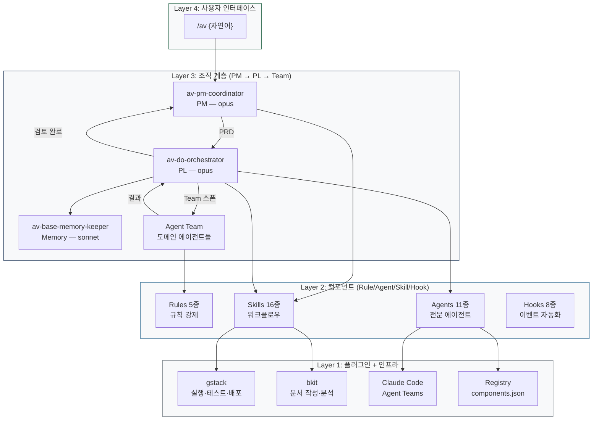
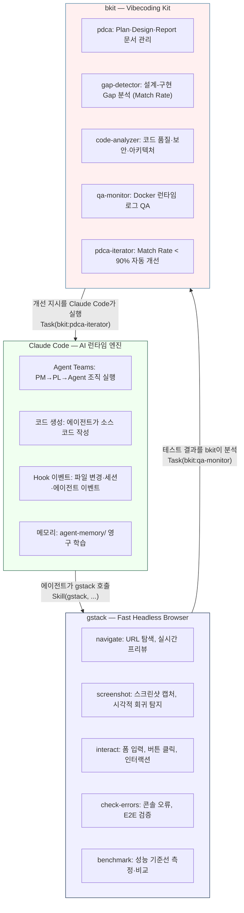
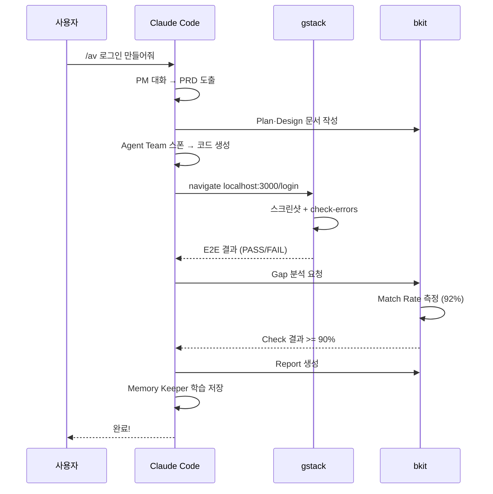
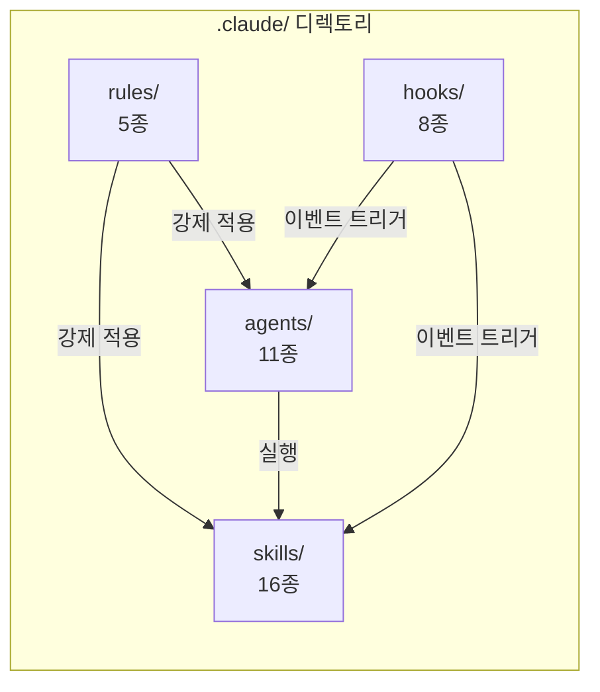
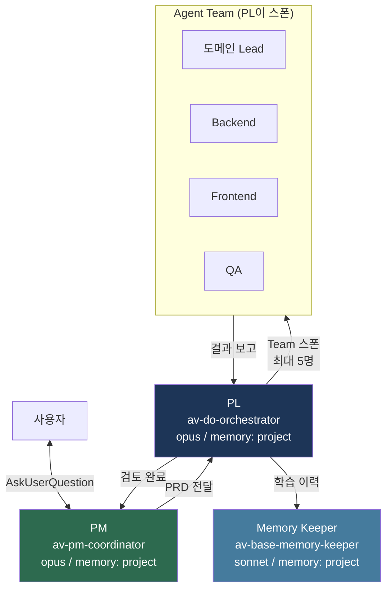
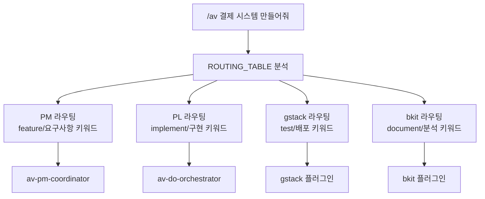
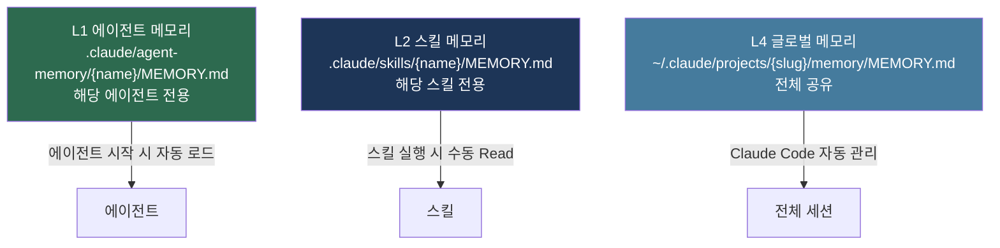

# 03. AutoVibe 아키텍처

> **목표**: AutoVibe의 4-Layer 구조와 각 레이어의 역할, 레이어 간 통신 방식을 이해합니다.
> **소요 시간**: 20분

---

## 전체 아키텍처 개요



---

## Layer 1: 플러그인 + 인프라 (생태계 3축)

AutoVibe가 동작하는 기반 인프라입니다. **3개의 독립 플랫폼**이 상호 보완하여 하나의 AI 개발 생명주기를 구성합니다.

### 생태계 3축 상세



| 구성 요소 | 정체성 | 핵심 기능 | 호출 방식 |
|-----------|--------|----------|----------|
| **Claude Code** | Anthropic AI 런타임 엔진 | Agent Teams, 코드 생성, Hook 이벤트, 메모리 | av 생태계의 실행 기반 |
| **gstack** | Fast Headless Browser | 페이지 탐색, E2E 테스트, 스크린샷, 인터랙션, 벤치마크 | `Skill("gstack", "navigate {url}")` |
| **bkit** | Vibecoding Kit 플러그인 | PDCA 문서, Gap 분석, 코드 분석, QA 모니터링, 자동 개선 | `Skill("bkit:pdca", ...)` / `Task("bkit:*", ...)` |
| **Registry** | 컴포넌트 메타데이터 | `components.json` — 모든 컴포넌트 등록 정보 | av 내부 참조 |

### 3축 협업 시나리오



### gstack 7단계 생명주기

gstack은 개발 과정 전체에서 7단계로 활용됩니다:

| 단계 | 명칭 | gstack 명령 | 담당자 | PDCA 매핑 |
|------|------|------------|--------|----------|
| 1 | **Think** | `navigate {ref-url}` | PM | Plan |
| 2 | **Plan** | `screenshot {ref}` | PL | Plan |
| 3 | **Build** | `navigate localhost:{port}` | Agent Team | Do |
| 4 | **Review** | `screenshot {pages}` | PL | Check |
| 5 | **Test** | `check-errors {url}` + `interact {selector}` | QA | Check |
| 6 | **Ship** | `Skill("canary", ...)` | PL | Deploy |
| 7 | **Reflect** | `Skill("benchmark", ...)` | Memory Keeper | Report |

### Registry (components.json) 구조

```json
{
  "_meta": {
    "version": "2.0",
    "total": { "agents": 11, "skills": 16, "hooks": 8, "rules": 5 }
  },
  "rules": { "av-base-spec": { "file": ".claude/rules/av-base-spec.md", ... } },
  "agents": { "av-pm-coordinator": { "model": "opus", "memory": "project", ... } },
  "skills": { "av": { "user-invocable": true, ... } },
  "hooks": { "av-post-write-monitor": { "hook-type": "PostToolUse", ... } }
}
```

---

## Layer 2: 컴포넌트

4가지 유형의 컴포넌트가 `.claude/` 디렉토리에 존재합니다.



### 4가지 컴포넌트 유형

| 유형 | 파일 형식 | 호출 방식 | 역할 |
|------|----------|----------|------|
| **Rule** | `.md` (frontmatter) | 자동 로드 / paths 지연 로딩 | 규칙 강제 (네이밍, 조직, 메모리) |
| **Agent** | `.md` (frontmatter) | `Agent("이름")` 또는 `Task("이름")` | 전문 에이전트 (PM, PL, QA 등) |
| **Skill** | `SKILL.md` (디렉토리) | `/스킬명` 또는 `Skill("이름")` | 워크플로우 (forge, 게이트웨이 등) |
| **Hook** | `.sh` (셸 스크립트) | Claude Code 이벤트 자동 | 이벤트 반응 (파일 쓰기, 에이전트 종료 등) |

### 네이밍 규칙

```
av-{그룹}-{이름}

그룹:
  base  — 범용 필수 (모든 프로젝트에 필요)
  vibe  — 메타 (생태계 자체 관리)
  util  — 범용 선택 (필요할 때 추가)
  {도메인} — 프로젝트 전용 (Phase 6에서 생성)
```

예시:
- `av-base-spec` — base 그룹, 중앙 규칙
- `av-vibe-forge` — vibe 그룹, 메타 오케스트레이터
- `av-base-auditor` — base 그룹, 코드 감사
- `av-order-lead` — order 도메인, 주문 리드

---

## Layer 3: 조직 계층

AutoVibe의 핵심 차별점입니다. 에이전트가 **조직 구조**를 가집니다.



### 승인 프로세스

| 단계 | 승인자 | 기준 |
|------|--------|------|
| PRD 확정 | 사용자 | PM 대화 후 요구사항 합의 |
| Plan/Design 확정 | PM | PL이 작성한 문서 검토 |
| 구현 완료 | PL | Match Rate >= 90% + gstack E2E PASS |
| 최종 승인 | PM | 요구사항 충족 여부 확인 |

### 에이전트 권한

| 에이전트 | 사용 가능 | 사용 불가 |
|---------|----------|----------|
| PM | AskUserQuestion, Skill, Agent, Read, Write | Bash |
| PL | 모든 도구 | — |
| Base Agent | Read, Write, Edit, Glob, Grep | Agent Team 스폰 |
| Domain Agent | 도메인 스코프 내 도구 | 다른 도메인 파일 수정 |

---

## Layer 4: 사용자 인터페이스

사용자는 **하나의 명령어**만 알면 됩니다.

```
/av {자연어 요청}
```

### 라우팅 흐름



### 자주 사용하는 명령어

| 명령어 | 라우팅 | 결과 |
|--------|--------|------|
| `/av 결제 시스템 만들어줘` | PM | 대화 → PRD → 구현 |
| `/av 코드 품질 분석해줘` | bkit:code-analyzer | 코드 분석 리포트 |
| `/av 브라우저에서 테스트해줘` | gstack | E2E 테스트 실행 |
| `/av 성능 벤치마크` | gstack benchmark | 성능 측정 |
| `/av 현재 상태` | /pdca status | PDCA 진행 상황 |

---

## 레이어 간 통신 정리

| 출발 | 도착 | 통신 방식 | 예시 |
|------|------|----------|------|
| 사용자 → PM | AskUserQuestion | PM이 질문, 사용자가 답변 |
| PM → PL | Agent() | PRD 전달, 구현 요청 |
| PL → Agent Team | Agent Teams | Task 할당, 병렬 구현 |
| PL → gstack | Skill("gstack") | 브라우저 테스트/스크린샷 |
| PL → bkit | Skill("bkit:pdca") | 문서 작성, 갭 분석 |
| Hook → Agent | settings.json 이벤트 | 파일 쓰기 후 자동 감사 |
| Agent → Memory | memory: project | MEMORY.md 자동 관리 |

---

## 메모리 계층



| 계층 | 관리 방식 | 지속성 |
|------|---------|--------|
| L1 에이전트 | `memory: project` 자동 | 프로젝트 영구 |
| L2 스킬 | 수동 Read/Write | 프로젝트 영구 |
| L4 글로벌 | Claude Code auto-memory | 사용자 영구 |

---

**다음**: [04-시작-가이드.md](04-시작-가이드.md) -- Phase 0~6 단계별 구축 전체 가이드
