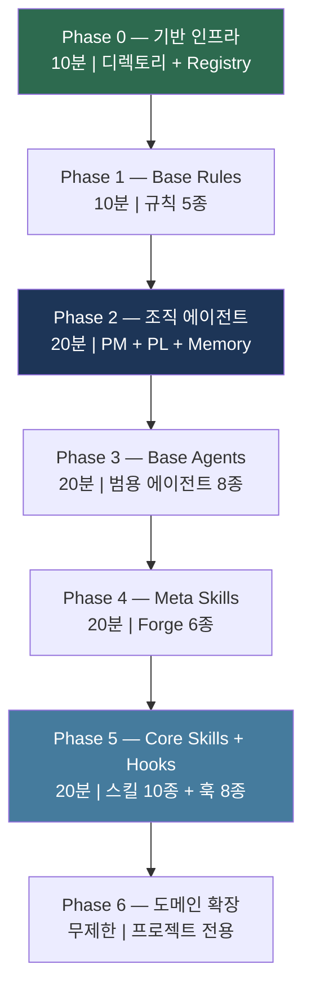
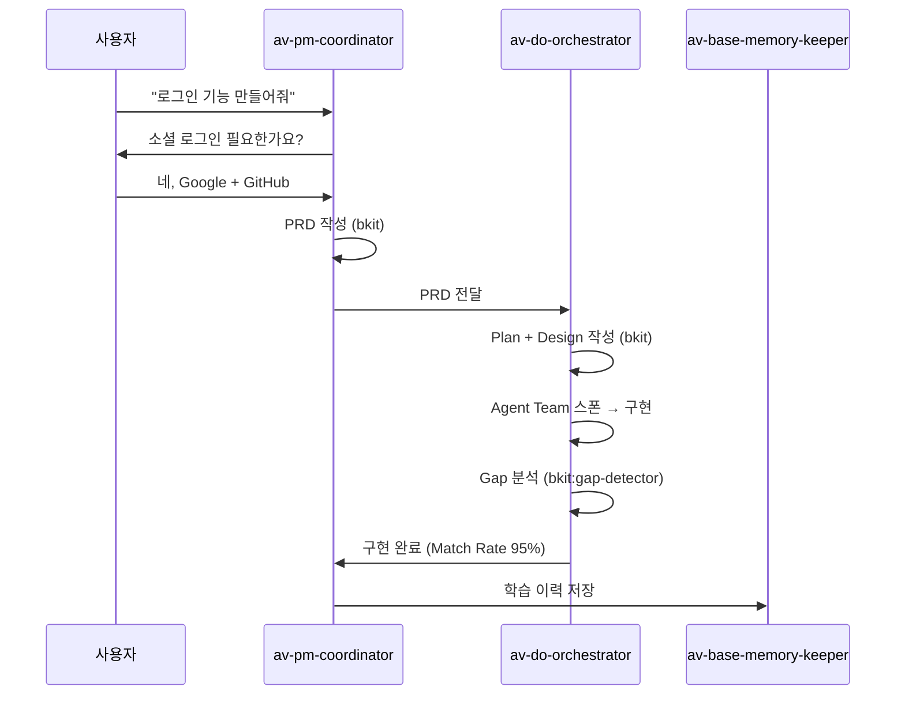
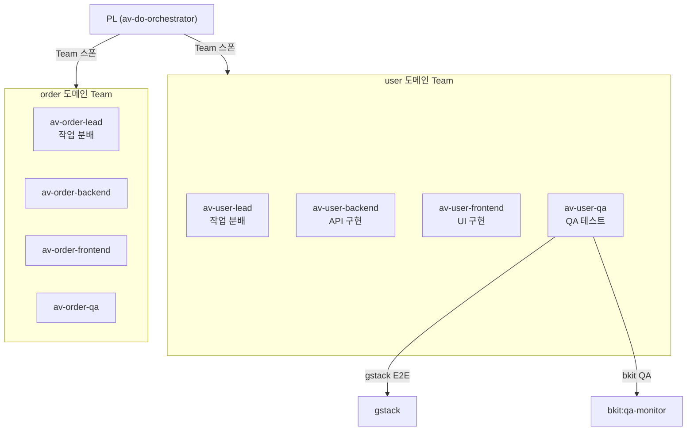

# 04. AutoVibe 시작 가이드 (Phase 0~6)

> **목표**: 새 프로젝트에서 AutoVibe 생태계를 Phase별로 구축합니다.
> **소요 시간**: 약 2시간 (전체) / Phase별 10~20분
> **선행**: [01-퀵스타트-30분.md](01-퀵스타트-30분.md)에서 Phase 0 완료

---

## Phase 전체 흐름



> Phase 3까지만 완료해도 기본적인 조직 워크플로우가 동작합니다.

---

## Phase 0: 기반 인프라 구축

**생성물**: `.claude/` 디렉토리 구조 + 빈 Registry + CLAUDE.md + settings.json

### Claude에게 요청

```
AutoVibe 생태계를 구축하고 싶어. Phase 0부터 시작해줘.
docs/autovibe/design/av-ecosystem-design-spec.md 를 참고해서.
```

### Claude가 묻는 질문

| 질문 | 예시 답변 | 용도 |
|------|---------|------|
| "프로젝트 이름은?" | `my-saas` | Registry, CLAUDE.md |
| "기술 스택은?" | `NestJS + Next.js` | Rule 커스터마이즈 |
| "주요 도메인은?" | `user, order, payment` | Phase 6 에이전트 생성 |
| "소스 루트 경로는?" | `src` | paths 지연 로딩 설정 |

### 완료 확인

```bash
ls -la .claude/                              # 6개 하위 디렉토리
cat .claude/registry/components.json         # 빈 레지스트리
grep -A 5 "AutoVibe" CLAUDE.md               # AutoVibe 섹션
```

---

## Phase 1: Base Rules 생성 (5종)

**생성물**: 생태계 핵심 규칙 파일 5개

### Claude에게 요청

```
AutoVibe Phase 1 진행해줘. Base Rules 5종 생성.
```

### Claude가 묻는 질문

| 질문 | 예시 답변 |
|------|---------|
| "조직 승인 프로세스가 필요한가요?" | 네, PM→PL→Agent 3단계 |
| "멀티테넌트 지원이 필요한가요?" | 아니오 |

### 생성되는 파일

```
.claude/rules/
├── av-base-spec.md             # 중앙 규칙 인덱스
├── av-org-protocol.md          # PM→PL→Agent 승인 프로토콜
├── av-base-memory-first.md     # 메모리 우선 읽기 원칙
├── av-util-mermaid-std.md      # Mermaid 다이어그램 표준
└── av-base-plugin-routing.md   # gstack/bkit 플러그인 라우팅
```

### Rule의 핵심 기능: 지연 로딩

```yaml
# paths가 있으면 해당 파일을 열 때만 로드 (컨텍스트 절약)
paths:
  - ".claude/agents/**"
  - ".claude/skills/**"

# paths가 없으면 세션 시작 시 항상 로드
```

---

## Phase 2: 조직 에이전트 생성 (3종)

**생성물**: PM + PL + Memory Keeper — 이후 모든 작업의 핵심

### Claude에게 요청

```
AutoVibe Phase 2 진행해줘. 조직 에이전트 3종 생성.
```

### Claude가 묻는 질문

| 질문 | 기본값 | 설명 |
|------|--------|------|
| "PM 최대 질문 수는?" | 6개 | 과도한 질문 방지 |
| "PL Agent Team 최대 인원은?" | 5명 | Lead + Backend + Frontend + QA + 1 |
| "기억에 무엇을 저장?" | 의사결정, 패턴, 아키텍처 | Memory Keeper 범위 |

### 생성되는 파일

```
.claude/agents/
├── av-pm-coordinator.md        # PM — opus, memory: project
├── av-do-orchestrator.md       # PL — opus, memory: project
└── av-base-memory-keeper.md    # Memory — sonnet, memory: project
```

### 핵심: memory: project

```yaml
# 공식 Claude Code 스펙 — 에이전트 영구 메모리
memory: project
# → .claude/agent-memory/{name}/MEMORY.md 자동 생성/로드
```

### 조직 동작 확인



---

## Phase 3: Base Agents 생성 (8종)

**생성물**: 모든 프로젝트에 필요한 범용 에이전트

### Claude에게 요청

```
AutoVibe Phase 3 진행해줘. Base Agents 8종 생성.
```

### Claude가 묻는 질문

| 질문 | 예시 답변 |
|------|---------|
| "코드 품질 체크 도구는?" | Biome (또는 ESLint, Ruff) |
| "감사 레벨은?" | 3단계 (Self-Check / 표준 / 종합) |

### 생성되는 파일

| 에이전트 | 역할 | 플러그인 통합 |
|---------|------|-------------|
| `av-base-auditor` | 코드 품질 검증 | bkit:code-analyzer |
| `av-base-optimizer` | 토큰/컴포넌트 최적화 | — |
| `av-base-template` | 템플릿 스캐폴딩 | — |
| `av-base-git-committer` | 커밋 메시지 생성 | — |
| `av-base-refactor-advisor` | 리팩토링 탐지 | — |
| `av-base-qa-reviewer` | QA 검수 | gstack E2E + bkit:qa-monitor |
| `av-base-sync-auditor` | CLAUDE.md 정합성 | — |
| `av-vibe-vibecoder` | 생태계 갭 분석 | bkit:gap-detector |

### 감사 레벨 체계

| Level | 범위 | 트리거 |
|-------|------|--------|
| Level 1 | 자기 출력물만 | 모든 에이전트 종료 시 |
| Level 2 | 변경 파일 전체 | PL/PM 요청 시 |
| Level 3 | 전체 코드베이스 | 릴리즈 전 |

---

## Phase 4: Meta Skills / Forge 생성 (6종)

**생성물**: 생태계 자체를 관리하는 메타 스킬

### Claude에게 요청

```
AutoVibe Phase 4 진행해줘. Meta Skills 6종 생성.
```

### Claude가 묻는 질문

| 질문 | 예시 답변 |
|------|---------|
| "컴포넌트 그룹 체계는?" | core: user, product / extended: analytics |
| "기본 라우팅 전략은?" | 도메인별 자동 위임 |

### 생성되는 파일

| 스킬 | 역할 |
|------|------|
| `av-vibe-forge` | 마스터 오케스트레이터 (14 서브커맨드) |
| `av-vibe-skill-forge` | 스킬 생성 전담 |
| `av-vibe-agent-forge` | 에이전트 생성 전담 |
| `av-vibe-hook-forge` | 훅 생성 전담 |
| `av-vibe-rule-forge` | 룰 생성 전담 |
| `av-vibe-portable-init` | 신규 프로젝트 초기화 |

### Forge 사용법

```
# 새 에이전트 생성
/av-vibe-forge agent {domain}-lead --group {domain}

# 새 스킬 생성
/av-vibe-forge skill {name} --group base

# 생태계 건강도 확인
/av-vibe-forge health

# 전체 컴포넌트 목록
/av-vibe-forge list
```

---

## Phase 5: Core Skills + Hooks 생성

**생성물**: 일상 워크플로우 스킬 10종 + 이벤트 훅 8종

### Claude에게 요청

```
AutoVibe Phase 5 진행해줘. Core Skills + Hooks 생성.
```

### Claude가 묻는 질문

| 질문 | 예시 답변 |
|------|---------|
| "UI가 있는 프로젝트인가요?" | 네 → gstack 브라우저 QA 포함 |
| "bkit 품질 게이트 수준은?" | Match Rate 90% (기본값) |
| "ROUTING_TABLE 커스텀 규칙은?" | 결제 관련 → payment 도메인 |

### 생성되는 스킬

| 스킬 | 역할 | 플러그인 |
|------|------|---------|
| `av` | 마스터 게이트웨이 | gstack + bkit 라우팅 |
| `av-pm` | PM 대화 인터페이스 | bkit:pdca |
| `av-base-code-quality` | 코드 품질 게이트 | bkit:code-analyzer |
| `av-base-git-commit` | 커밋 자동화 | — |
| `av-base-sync` | CLAUDE.md 동기화 | — |
| `av-base-refactor` | 리팩토링 스킬 | — |
| `av-base-post-qa` | QA 오케스트레이션 | gstack + bkit:qa-monitor |
| `av-ecosystem-optimizer` | 생태계 최적화 | — |
| `av-agent-chat` | 에이전트 대화 | — |
| `av-docs-guard` | 문서 감시 | bkit:design-validator |

### 생성되는 훅

| 훅 | 이벤트 | 역할 |
|----|--------|------|
| `av-post-write-monitor` | PostToolUse(Write) | 파일 작성 후 감사 |
| `av-session-discovery` | SessionStart | 세션 시작 시 상태 표시 |
| `av-agent-spawn-logger` | SubagentStart | 에이전트 시작 로깅 |
| `av-agent-complete-logger` | SubagentStop | 에이전트 종료 로깅 |
| `av-config-watcher` | ConfigChange | 설정 변경 감지 |
| + 3개 프로젝트 커스텀 | 대화로 결정 | — |

---

## Phase 6: 도메인 확장 (무제한)

**생성물**: 프로젝트 고유 도메인 에이전트와 스킬

### Claude에게 요청

```
AutoVibe Phase 6 — user 도메인 에이전트 만들어줘.
```

또는:

```
/av-vibe-forge agent user-lead --group user
/av-vibe-forge agent user-backend --group user
/av-vibe-forge agent user-frontend --group user
/av-vibe-forge agent user-qa --group user
```

### 도메인 에이전트 구조



### 도메인 확장은 반복 가능

새 도메인이 필요할 때마다 Phase 6을 반복합니다:

```
/av payment 도메인 에이전트 팀 만들어줘
```

---

## Phase 완료 후 검증

### 전체 건강도 확인

```
/av-vibe-forge health
```

### 기대 결과

```
AutoVibe Health Report
─────────────────────
Rules:    5/5  ✅
Agents:  11/11 ✅
Skills:  16/16 ✅
Hooks:    8/8  ✅
Registry: ✅ Synced
Memory:   ✅ Active
```

### 동작 확인

```
/av 로그인 기능 만들어줘
```

PM이 대화를 시작하면 전체 파이프라인이 동작하는 것입니다.

---

**다음**: [05-컴포넌트-레퍼런스.md](05-컴포넌트-레퍼런스.md) -- Rule, Agent, Skill, Hook 상세 명세
