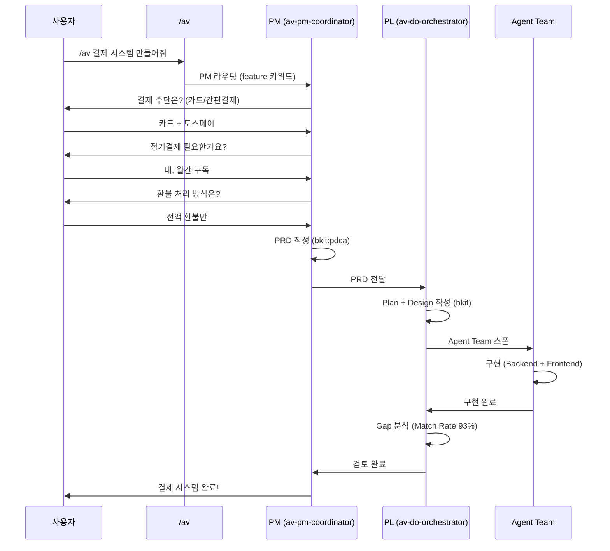
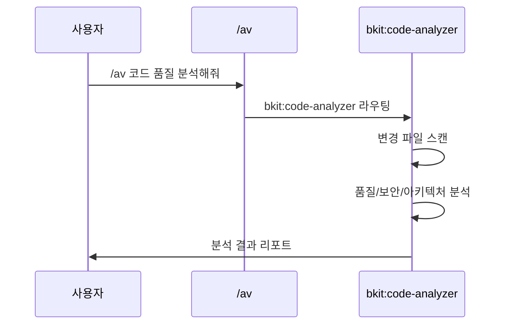
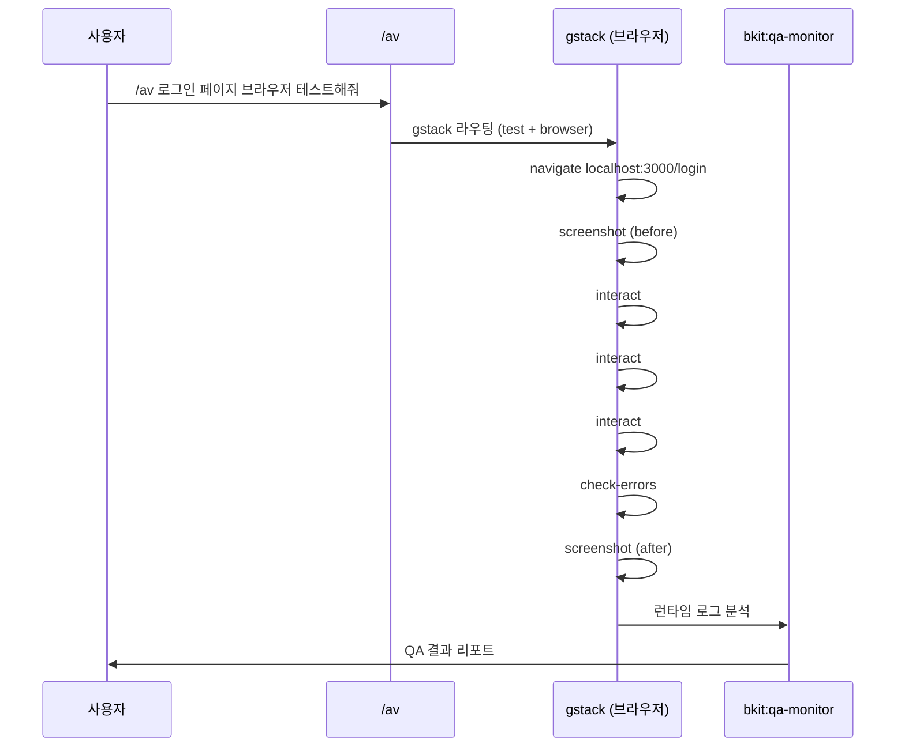
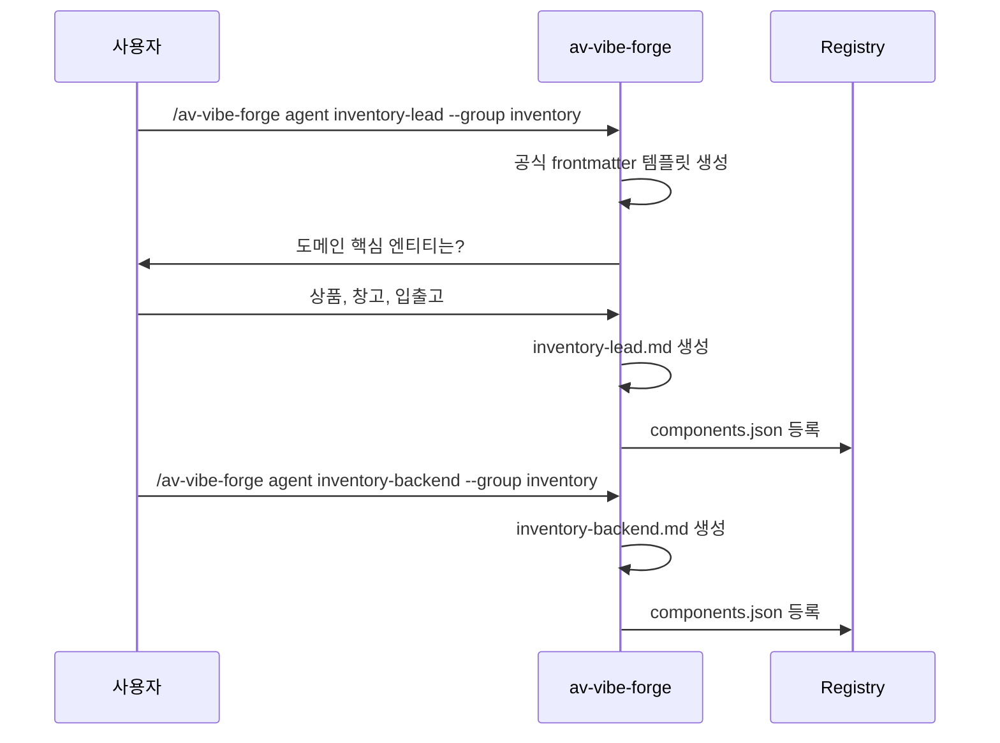
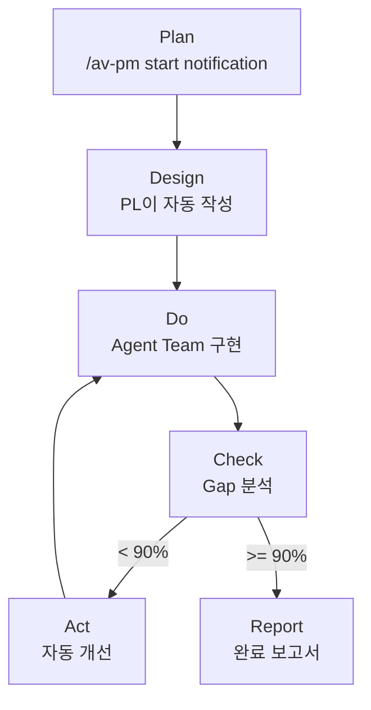
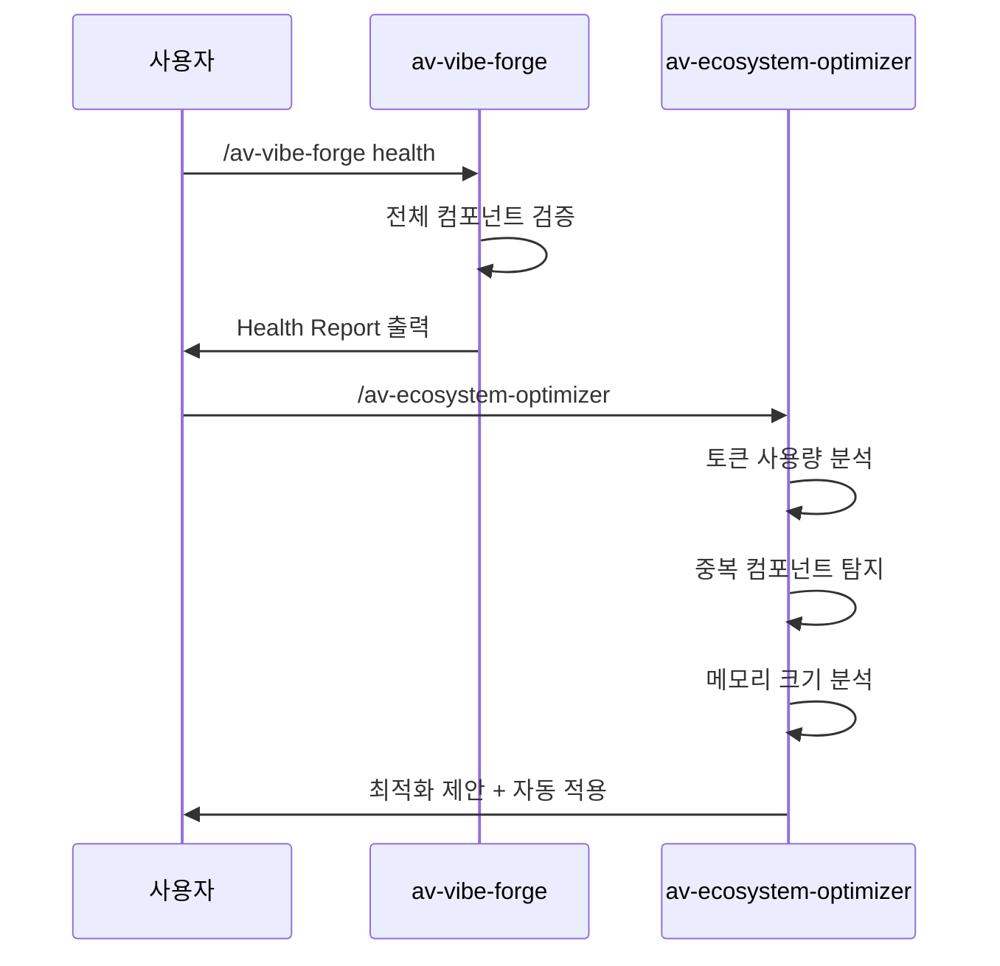

# 06. 워크플로우 예제

> **목표**: 실전 대화 시나리오 6종을 통해 AutoVibe 사용법을 익힙니다.
> **소요 시간**: 30분 (읽기) / 각 시나리오 실습 별도

---

## 시나리오 목록

| # | 시나리오 | 난이도 | 핵심 |
|---|---------|--------|------|
| 1 | 새 기능 요청 | 기본 | PM 대화 → PRD → 구현 |
| 2 | 코드 품질 분석 | 기본 | bkit:code-analyzer |
| 3 | 브라우저 QA 테스트 | 중급 | gstack + bkit:qa-monitor |
| 4 | 새 도메인 에이전트 생성 | 중급 | Forge + Phase 6 |
| 5 | PDCA 전체 사이클 | 고급 | Plan → Do → Check → Act → Report |
| 6 | 생태계 건강도 관리 | 고급 | optimizer + health check |

---

## 시나리오 1: 새 기능 요청

**상황**: "결제 시스템을 만들어줘"

### 대화 흐름



### 실제 입력

```
/av 결제 시스템 만들어줘
```

PM이 자동으로 대화를 시작합니다. 질문에 답변하면 나머지는 자동으로 진행됩니다.

---

## 시나리오 2: 코드 품질 분석

**상황**: "최근 변경한 코드 품질이 괜찮은지 확인하고 싶다"

### 대화 흐름



### 실제 입력

```
/av 코드 품질 분석해줘
```

또는 직접:

```
/av-base-code-quality
```

### 기대 결과

```
Code Quality Report
─────────────────────
Files analyzed: 12
Issues found: 3
  - WARN: Unused import in src/payment/service.ts:5
  - WARN: Missing error handling in src/payment/controller.ts:42
  - INFO: Consider extracting shared logic in src/utils/
Overall: 8.5/10
```

---

## 시나리오 3: 브라우저 QA 테스트

**상황**: "로그인 페이지가 제대로 동작하는지 브라우저에서 테스트해줘"

### 대화 흐름



### 실제 입력

```
/av 로그인 페이지 브라우저 테스트해줘
```

또는 직접:

```
/av-base-post-qa
```

### 기대 결과

```
QA Report — Login Page
─────────────────────
Browser E2E: PASS (gstack)
  - Page load: 1.2s
  - Form submit: OK
  - Redirect after login: OK
  - Console errors: 0
Runtime QA: PASS (bkit:qa-monitor)
  - No unexpected errors in logs
Screenshots: 2 captured (before/after)
```

---

## 시나리오 4: 새 도메인 에이전트 생성

**상황**: "inventory(재고) 도메인이 새로 필요하다"

### 대화 흐름



### 실제 입력 순서

```
# 1. Lead 에이전트 생성
/av-vibe-forge agent inventory-lead --group inventory

# 2. Backend 에이전트 생성
/av-vibe-forge agent inventory-backend --group inventory

# 3. Frontend 에이전트 생성
/av-vibe-forge agent inventory-frontend --group inventory

# 4. QA 에이전트 생성
/av-vibe-forge agent inventory-qa --group inventory

# 5. 건강도 확인
/av-vibe-forge health
```

---

## 시나리오 5: PDCA 전체 사이클

**상황**: "알림 기능을 PDCA 사이클로 체계적으로 진행하고 싶다"

### 전체 흐름



### 단계별 실제 입력

```
# Step 1: PM 대화 시작
/av 알림 기능 만들어줘

# (PM이 질문 → 사용자 답변 → PRD 자동 생성)

# Step 2: PDCA 진행 상황 확인
/pdca status

# Step 3: Gap 분석 (구현 완료 후)
/av 구현 결과 검증해줘

# Step 4: 자동 개선 (90% 미만 시)
# → PL이 자동으로 pdca-iterator 실행

# Step 5: 완료 보고서
/av 완료 보고서 작성해줘
```

### PDCA 상태 확인

```
/pdca status

┌─── Workflow Map: notification ──────────────────┐
│ [PM ✓]→[PLAN ✓]→[DESIGN ✓]→[DO ✓]→[CHECK ▶]   │
│ Iter: 1  •  matchRate: 92%                      │
└─────────────────────────────────────────────────┘
```

---

## 시나리오 6: 생태계 건강도 관리

**상황**: "한동안 작업했는데, 생태계 상태를 점검하고 최적화하고 싶다"

### 대화 흐름



### 실제 입력 순서

```
# 1. 건강도 확인
/av-vibe-forge health

# 2. 최적화 실행
/av-ecosystem-optimizer

# 3. CLAUDE.md 정합성 확인
/av-base-sync

# 4. 전체 컴포넌트 목록 확인
/av-vibe-forge list
```

### 건강도 리포트 예시

```
AutoVibe Health Report
─────────────────────────
Components:
  Rules:    5/5  ✅
  Agents:  14/14 ✅  (11 base + 3 domain)
  Skills:  16/16 ✅
  Hooks:    8/8  ✅

Registry:  ✅ Synced
Memory:    ✅ Active (3 agents with history)
CLAUDE.md: ✅ Up-to-date

Optimization:
  Token usage: 42K (within budget)
  Unused agents: 0
  Oversized memories: 1 (av-base-memory-keeper: 15KB)
    → Recommend: /av-ecosystem-optimizer trim-memory
```

---

## 명령어 요약 (치트 시트)

### 일상 명령어

| 명령어 | 용도 |
|--------|------|
| `/av {자연어}` | 모든 요청의 시작점 |
| `/pdca status` | 현재 PDCA 진행 상황 |
| `/av-base-code-quality` | 코드 품질 분석 |
| `/av-base-git-commit` | 커밋 메시지 자동 생성 |

### 관리 명령어

| 명령어 | 용도 |
|--------|------|
| `/av-vibe-forge health` | 생태계 건강도 |
| `/av-vibe-forge list` | 컴포넌트 목록 |
| `/av-ecosystem-optimizer` | 최적화 |
| `/av-base-sync` | CLAUDE.md 동기화 |

### 생성 명령어

| 명령어 | 용도 |
|--------|------|
| `/av-vibe-forge agent {name} --group {g}` | 새 에이전트 생성 |
| `/av-vibe-forge skill {name} --group {g}` | 새 스킬 생성 |
| `/av-vibe-forge hook {name}` | 새 훅 생성 |
| `/av-vibe-forge rule {name} --group {g}` | 새 룰 생성 |

---

**다음**: [07-AI-바이브코딩.md](07-AI-바이브코딩.md) -- 구축/사용/유지관리 종합 가이드
