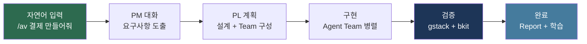
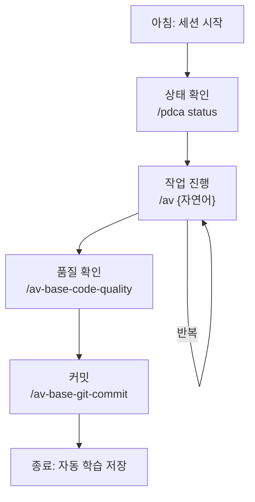
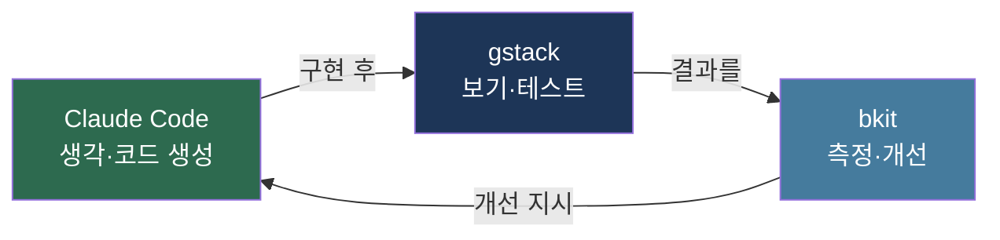
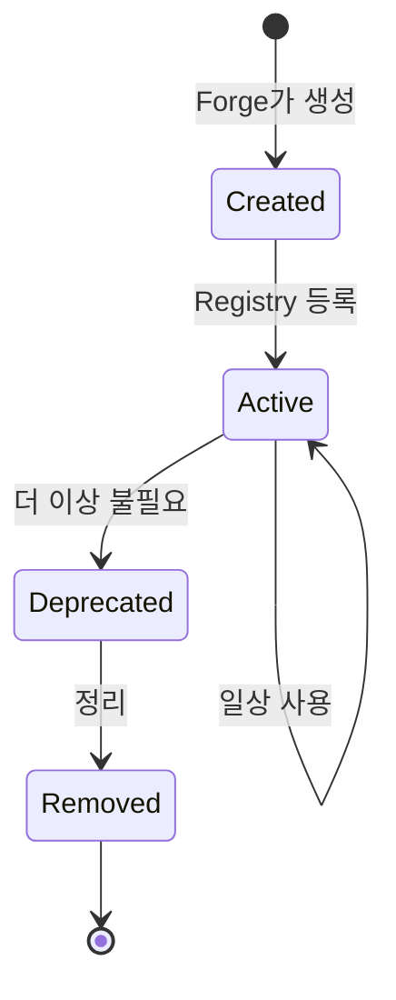

# 07. AI 바이브코딩 종합 가이드

> **목표**: AutoVibe 생태계의 구축, 일상 사용, 유지관리를 종합적으로 이해합니다.
> **대상**: 생태계 구축을 완료한 사용자

---

## AI 바이브코딩이란

자연어로 대화하면 AI 에이전트 조직이 요구사항 도출부터 구현, 테스트, 배포까지 전체 개발 생명주기를 관리하는 방식입니다.



---

## 1부: 구축 (Build)

### 구축 전략

| 전략 | 설명 | 추천 |
|------|------|------|
| **Full Build** | Phase 0~6 전체 순서대로 | 새 프로젝트 시작 시 |
| **Portable Init** | `/av-vibe-portable-init`으로 원클릭 | 빠른 시작 |
| **Selective** | 필요한 Phase만 선택 | 기존 프로젝트에 추가 |

### Full Build 타임라인

| Phase | 시간 | 산출물 | 대화 포인트 |
|-------|------|--------|------------|
| 0 | 10분 | 디렉토리 + Registry | 프로젝트명, 스택 |
| 1 | 10분 | Rules 5종 | 조직 프로세스, 멀티테넌트 |
| 2 | 20분 | 조직 에이전트 3종 | PM 질문수, Team 인원 |
| 3 | 20분 | Base Agents 8종 | 품질 도구, 감사 레벨 |
| 4 | 20분 | Meta Skills 6종 | 그룹 체계, 라우팅 |
| 5 | 20분 | Skills 10종 + Hooks 8종 | UI 여부, 품질 게이트 |
| 6 | — | 도메인 에이전트 | 도메인별 엔티티 |

### Portable Init (원클릭)

```
/av-vibe-portable-init
```

Claude가 자동으로 Phase 0~5를 순서대로 실행하며, 각 Phase에서 필요한 질문을 합니다.

---

## 2부: 일상 사용 (Use)

### 일상 워크플로우



### 핵심 사용 패턴

#### 패턴 1: 기능 개발

```
/av {기능 설명}
```

PM이 대화 → PRD → PL이 계획 → Agent Team이 구현 → 자동 검증

#### 패턴 2: 코드 리뷰

```
/av 코드 리뷰해줘
```

bkit:code-analyzer가 품질/보안/아키텍처 분석

#### 패턴 3: 브라우저 테스트

```
/av 브라우저에서 테스트해줘
```

gstack이 E2E 테스트 + bkit:qa-monitor가 런타임 QA

#### 패턴 4: 리팩토링

```
/av 리팩토링 기회 분석해줘
```

av-base-refactor-advisor가 중복/복잡도/의존성 분석

#### 패턴 5: 에이전트와 직접 대화

```
/av-agent-chat av-base-memory-keeper
```

특정 에이전트와 1:1 대화 (디버깅, 학습 확인)

### 3축 통합 활용 가이드

AutoVibe는 Claude Code + gstack + bkit 3축을 `/av {자연어}` 하나로 자동 라우팅합니다. 하지만 각 축을 직접 제어하면 더 정밀한 개발이 가능합니다.

#### 3축 역할 요약



#### gstack 직접 사용 (보기·테스트)

| 목적 | 명령어 | 언제 |
|------|--------|------|
| 페이지 탐색 | `/gstack navigate https://example.com` | 레퍼런스 확인, 경쟁사 분석 |
| 스크린샷 캡처 | `/gstack screenshot` | 시각적 회귀 비교, 디자인 리뷰 |
| 인터랙션 테스트 | `/gstack interact #login-button` | 폼 제출, 버튼 클릭 검증 |
| 콘솔 오류 확인 | `/gstack check-errors` | JS 에러, 네트워크 실패 탐지 |
| 성능 측정 | `/benchmark` | 페이지 로드 시간, Core Web Vitals |
| 카나리 배포 감시 | `/canary` | 배포 후 실시간 모니터링 |

#### bkit 직접 사용 (측정·개선)

| 목적 | 명령어 | 언제 |
|------|--------|------|
| PDCA 문서 작성 | `/bkit:pdca plan {feature}` | 새 기능 시작 시 |
| 설계 문서 작성 | `/bkit:pdca design {feature}` | Plan 완료 후 |
| Gap 분석 | `/bkit:pdca analyze {feature}` | 구현 완료 후 |
| 코드 품질 분석 | `/av-base-code-quality` | PR 전, 리뷰 전 |
| 자동 개선 반복 | `/pdca iterate {feature}` | Match Rate < 90% 시 |
| 완료 보고서 | `/bkit:pdca report {feature}` | Match Rate >= 90% 시 |

#### Claude Code 직접 사용 (생각·코드)

| 목적 | 명령어 | 언제 |
|------|--------|------|
| 에이전트 대화 | `/av-agent-chat {agent-name}` | 특정 에이전트와 1:1 소통 |
| 팀 스폰 | PL이 자동 관리 | 대규모 기능 구현 시 |
| 메모리 확인 | `/av-agent-chat av-base-memory-keeper` | 과거 의사결정 조회 |

#### 3축 통합 시나리오

```
# 1단계: gstack으로 경쟁사 레퍼런스 탐색
/gstack navigate https://competitor.com/pricing

# 2단계: bkit으로 기획 문서 작성
/av 가격 페이지 만들어줘  (PM 대화 → PRD → Plan)

# 3단계: Claude Code가 구현 (자동)

# 4단계: gstack으로 시각 확인
/gstack navigate localhost:3000/pricing
/gstack screenshot

# 5단계: bkit으로 품질 검증
/bkit:pdca analyze pricing-page

# 6단계: 완료!
/bkit:pdca report pricing-page
```

---

## 3부: 유지관리 (Maintain)

### 주기별 작업

| 주기 | 작업 | 명령어 |
|------|------|--------|
| **매일** | PDCA 상태 확인 | `/pdca status` |
| **매주** | 생태계 건강도 | `/av-vibe-forge health` |
| **매주** | CLAUDE.md 동기화 | `/av-base-sync` |
| **격주** | 생태계 최적화 | `/av-ecosystem-optimizer` |
| **매월** | 메모리 정리 | `/av-ecosystem-optimizer trim-memory` |

### 건강도 지표

| 지표 | 정상 | 주의 | 위험 |
|------|------|------|------|
| Registry 동기화 | Synced | 1~2개 불일치 | 5개 이상 불일치 |
| 메모리 크기 | < 10KB/agent | 10~50KB | > 50KB |
| 토큰 사용량 | < 50K | 50~100K | > 100K |
| 미사용 컴포넌트 | 0 | 1~3개 | 5개 이상 |

### 컴포넌트 생명주기



### 확장 전략

| 상황 | 대응 |
|------|------|
| 새 도메인 추가 | `/av-vibe-forge agent {domain}-lead --group {domain}` |
| 새 워크플로우 필요 | `/av-vibe-forge skill {name} --group util` |
| 자동화 이벤트 추가 | `/av-vibe-forge hook {name}` |
| 새 규칙 강제 | `/av-vibe-forge rule {name} --group base` |

---

## 효과적인 바이브코딩 팁

### 1. 구체적으로 요청하라

```
# 나쁨
/av 결제 만들어

# 좋음
/av 토스페이 카드결제 + 월간 구독 + 전액환불 기능 만들어줘
```

PM이 질문하긴 하지만, 처음부터 구체적이면 더 빠릅니다.

### 2. PDCA 사이클을 신뢰하라

Match Rate 90% 미만이면 자동으로 개선됩니다. 수동 개입보다 자동 사이클이 더 일관된 결과를 냅니다.

### 3. 메모리를 활용하라

```
/av-agent-chat av-base-memory-keeper
```

Memory Keeper에게 "이전에 결제 관련 결정사항이 뭐였어?"라고 물어보면, 과거 의사결정을 즉시 확인할 수 있습니다.

### 4. 건강도를 유지하라

주 1회 `/av-vibe-forge health` 실행만으로 문제를 조기 발견할 수 있습니다.

### 5. 생태계를 성장시켜라

Phase 6 도메인 확장은 제한 없이 반복 가능합니다. 새 비즈니스 요구가 생길 때마다 도메인 에이전트를 추가하세요.

---

**다음**: [08-프로젝트-이전.md](08-프로젝트-이전.md) -- 신규 프로젝트에 생태계 이전
