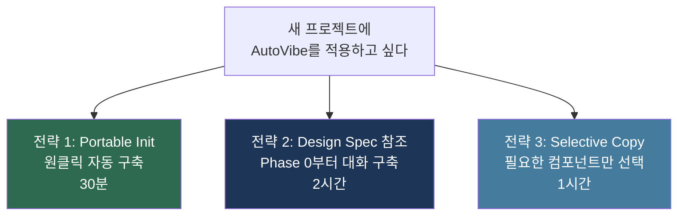
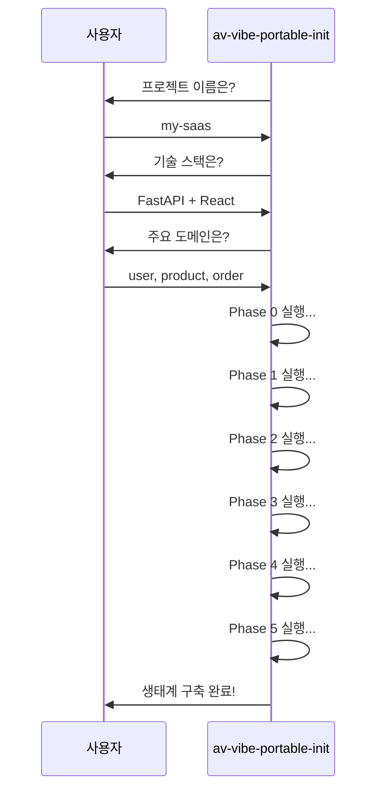
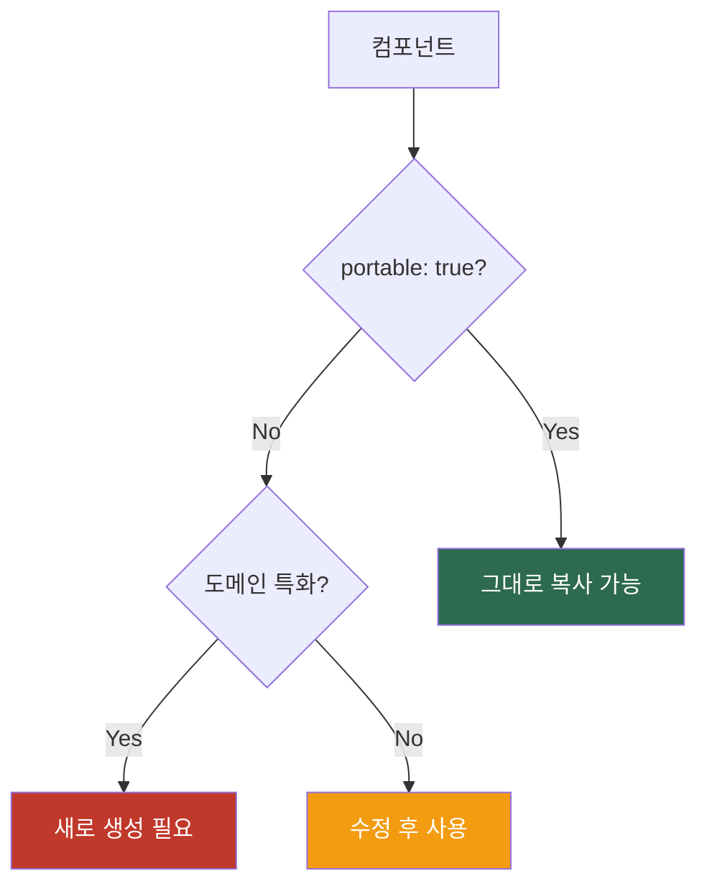

# 08. 프로젝트 이전 가이드

> **목표**: 기존 프로젝트 또는 새 프로젝트에 AutoVibe 4축 생태계를 이전합니다.
> **소요 시간**: 30분~2시간 (전략에 따라)

---

## 사전: 환경이 준비되어 있는가?

먼저 [00-WSL-환경설정.md](00-WSL-환경설정.md) 의 4축 검증을 통과해야 합니다.

```bash
# 한 번에 확인
claude doctor                                                # Claude Code OK
claude mcp list 2>/dev/null | grep gitnexus                  # gitnexus ✓ Connected
ls ~/.claude/skills/gstack/SKILL.md 2>/dev/null && echo gstack-OK
# Claude Code 안에서: /bkit /gstack /av 모두 메뉴 표시
```

준비가 안 됐다면 (Windows WSL 신규 환경 포함):

```bash
git clone https://github.com/s99606931/autovibe.git ~/autovibe
cd ~/autovibe
./wsl-setup/setup.sh
```

이 한 줄로 Node.js + Docker + Claude Code + gstack + GitNexus가 자동 설치됩니다. bkit만 Claude Code 안에서 `/plugin install bkit`로 설치합니다.

---

## 이전 전략 3가지



| 전략 | 추천 대상 | 장점 | 단점 |
|------|---------|------|------|
| **Portable Init** | 빠르게 시작하고 싶은 분 | 30분 완료 | 커스터마이즈 제한 |
| **Design Spec 참조** | 완전한 제어를 원하는 분 | 세밀한 커스터마이즈 | 시간 소요 |
| **Selective Copy** | 부분적으로 도입하는 분 | 유연함 | 의존성 수동 관리 |

---

## 전략 1: Portable Init (추천)

### 사전 준비

이미 ~/autovibe로 clone 되어 있다면 두 번째 줄부터:

```bash
git clone https://github.com/s99606931/autovibe.git ~/autovibe       # 환경 설정 시 이미 했다면 생략
cd ~/my-new-project
mkdir -p docs/autovibe
cp -r ~/autovibe/docs/* docs/autovibe/
cp -r ~/autovibe/guides docs/autovibe/guides
```

### 실행

```bash
cd ~/my-new-project
claude
```

Claude Code 안에서:

```
/av-vibe-portable-init
```

### 진행 과정



### 완료 후 확인

```
/av-vibe-forge health
```

---

## 전략 2: Design Spec 참조

### 사전 준비

동일하게 AutoVibe 문서를 복사합니다.

### 실행

```bash
cd my-new-project
claude
```

Claude에게:

```
AutoVibe 생태계를 구축하고 싶어. Phase 0부터 시작해줘.
docs/autovibe/design/av-ecosystem-design-spec.md 를 참고해서.
```

### 장점

- 매 Phase마다 Claude가 질문 → 사용자가 결정
- 기술 스택에 완벽히 맞춤 생성
- 필요 없는 컴포넌트 제외 가능

### 상세 과정

[04-시작-가이드.md](04-시작-가이드.md) 참고

---

## 전략 3: Selective Copy

기존 AutoVibe 프로젝트에서 필요한 부분만 가져옵니다.

### 필수 복사 파일

```bash
# 최소 필수 (Phase 0~1)
mkdir -p .claude/{rules,agents,skills,hooks,registry,agent-memory}

# 규칙 (반드시 필요)
cp source-project/.claude/rules/av-base-spec.md .claude/rules/
cp source-project/.claude/rules/av-org-protocol.md .claude/rules/
cp source-project/.claude/rules/av-base-plugin-routing.md .claude/rules/
```

### 선택 복사

| 컴포넌트 | 이식 가능 | 조건 |
|---------|----------|------|
| Base Rules | O | 그대로 사용 |
| 조직 에이전트 (PM/PL/MK) | O | 그대로 사용 |
| Base Agents | O | 그대로 사용 |
| Meta Skills (Forge) | O | 그대로 사용 |
| Core Skills | △ | ROUTING_TABLE 수정 필요 |
| Domain Agents | X | 프로젝트 고유 — 새로 생성 |
| Hooks | △ | 경로 확인 필요 |

### 이식 가능 여부 기준



### 복사 후 필수 작업

```bash
# 1. Registry 재생성
claude
```

Claude에게:

```
.claude/ 디렉토리의 컴포넌트를 스캔해서 components.json을 재생성해줘.
```

```bash
# 2. CLAUDE.md AutoVibe 섹션 추가
# Claude가 자동으로 처리

# 3. settings.json 훅 등록
# Claude가 자동으로 처리
```

---

## 이전 후 체크리스트

| 항목 | 확인 방법 | 기대 결과 |
|------|---------|----------|
| 디렉토리 구조 | `ls -la .claude/` | 6개 하위 디렉토리 |
| Registry | `cat .claude/registry/components.json` | 컴포넌트 목록 |
| CLAUDE.md | `grep AutoVibe CLAUDE.md` | AutoVibe 섹션 |
| 건강도 | `/av-vibe-forge health` | 전체 PASS |
| 동작 확인 | `/av 테스트 기능 만들어줘` | PM 대화 시작 |

---

## 기술 스택별 커스터마이즈 포인트

### Backend 프레임워크별

| 프레임워크 | 커스터마이즈 |
|-----------|------------|
| NestJS | Module/Service/Controller 패턴 규칙 |
| FastAPI | Router/Schema/Dependency 패턴 규칙 |
| Django | App/Model/View 패턴 규칙 |
| Go (Gin) | Handler/Service/Repository 패턴 규칙 |

### Frontend 프레임워크별

| 프레임워크 | 커스터마이즈 |
|-----------|------------|
| Next.js | App Router 규칙, Server Component |
| React | Component/Hook 패턴 규칙 |
| Vue | Composition API 규칙 |
| Svelte | Store/Component 패턴 규칙 |

이 커스터마이즈는 Phase 1 (Rules) 과 Phase 6 (Domain) 에서 Claude와 대화하며 설정합니다.

---

---

## 이전 후 첫 명령 — `/av {자연어}` 한 줄로 사용

이전 완료 후 모든 작업은 `/av` 한 줄로 시작합니다:

```
/av 주문 환불 기능 추가해줘
```

자동 흐름:
1. **PM 대화** (av-pm-coordinator) — AskUserQuestion으로 요구사항 도출
2. **PRD 작성** (bkit:pdca plan)
3. **PL Plan/Design** (av-do-orchestrator + bkit)
4. **Agent Team 스폰** — 격리(worktree) 옵션
5. **구현** — Claude Code 코드 생성
6. **gstack E2E** — 브라우저 검증
7. **bkit:gap-detector** — Match Rate 측정
8. **GitNexus 임팩트 분석** — 변경 블라스트 반경 평가
9. Match Rate < 90% 면 **bkit:pdca-iterator** 자동 개선 루프
10. **PM 최종 승인** → bkit Report → Archive → Memory Keeper 저장

| 자주 쓰는 명령 | 결과 |
|---------------|------|
| `/av {자연어}` | 자연어 → 최적 컴포넌트 자동 라우팅 |
| `/av-pm start {feature}` | PM 대화 → PRD 작성 |
| `/av-base-code-quality` | 코드 품질 게이트 (lint+typecheck+build+bkit) |
| `/av-base-post-qa` | gstack E2E + bkit qa-monitor |
| `/av-base-codegraph impact {file}` | GitNexus 임팩트 분석 |
| `/av-base-iterate` | 자동 개선 루프 (Match Rate 목표 도달) |
| `/av-vibe-forge health` | 생태계 건강도 0~100 보고서 |
| `/av-vibe-forge list` | 전체 컴포넌트 목록 |

전체 명령·시나리오: [06-워크플로우-예제.md](06-워크플로우-예제.md)

---

**다음**: [09-유지보수.md](09-유지보수.md) -- 건강도 관리, 최적화, 백업
