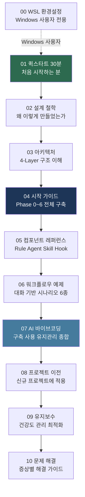

# AutoVibe 가이드 목차

> AI 바이브코딩 생태계 구축, 사용, 유지보수를 위한 종합 가이드입니다.
> **번호 순서대로** 읽으시면 자연스럽게 전체를 이해할 수 있습니다.

## AutoVibe 한 줄 요약

**Claude Code**(AI 런타임) + **gstack**(브라우저 테스트) + **bkit**(문서·분석) 3축을 `/av {자연어}` 하나로 통합하는 AI 개발 생태계입니다.

---

## 전체 가이드 읽기 순서

---

## 역할별 추천 가이드

### 처음 시작하는 분

| 순서 | 가이드 | 소요 시간 |
|------|--------|---------|
| 1 | [01-퀵스타트-30분.md](01-퀵스타트-30분.md) | 30분 |
| 2 | [02-설계-철학.md](02-설계-철학.md) | 15분 |
| 3 | [04-시작-가이드.md](04-시작-가이드.md) | 2시간 |

### 아키텍처를 이해하고 싶은 분

| 순서 | 가이드 | 핵심 |
|------|--------|------|
| 1 | [02-설계-철학.md](02-설계-철학.md) | 왜 이렇게 만들었는가 |
| 2 | [03-아키텍처.md](03-아키텍처.md) | 4-Layer 구조 |
| 3 | [05-컴포넌트-레퍼런스.md](05-컴포넌트-레퍼런스.md) | 상세 명세 |

### 새 프로젝트에 적용하고 싶은 분

| 순서 | 가이드 | 핵심 |
|------|--------|------|
| 1 | [08-프로젝트-이전.md](08-프로젝트-이전.md) | 이전 전략 3가지 |
| 2 | [09-유지보수.md](09-유지보수.md) | 건강도 관리 |

---

## 전체 가이드 목록

| # | 파일명 | 설명 | 대상 |
|---|--------|------|------|
| 00 | [00-WSL-환경설정.md](00-WSL-환경설정.md) | Windows WSL 개발환경 구축 | 환경 |
| 01 | [01-퀵스타트-30분.md](01-퀵스타트-30분.md) | 30분 안에 Phase 0 완료 | 입문 |
| 02 | [02-설계-철학.md](02-설계-철학.md) | Talk-First, Progressive Growth, PDCA | 이해 |
| 03 | [03-아키텍처.md](03-아키텍처.md) | 4-Layer 구조와 레이어 간 통신 | 이해 |
| 04 | [04-시작-가이드.md](04-시작-가이드.md) | Phase 0~6 단계별 구축 전체 | 구축 |
| 05 | [05-컴포넌트-레퍼런스.md](05-컴포넌트-레퍼런스.md) | Rule, Agent, Skill, Hook 상세 명세 | 레퍼런스 |
| 06 | [06-워크플로우-예제.md](06-워크플로우-예제.md) | 실전 대화 시나리오 6종 | 실전 |
| 07 | [07-AI-바이브코딩.md](07-AI-바이브코딩.md) | 구축/사용/유지관리 종합 | 종합 |
| 08 | [08-프로젝트-이전.md](08-프로젝트-이전.md) | 신규 프로젝트에 생태계 이전 | 운영 |
| 09 | [09-유지보수.md](09-유지보수.md) | 건강도 관리, 최적화, 백업 | 운영 |
| 10 | [10-문제-해결.md](10-문제-해결.md) | 증상별 해결 가이드 | 운영 |
