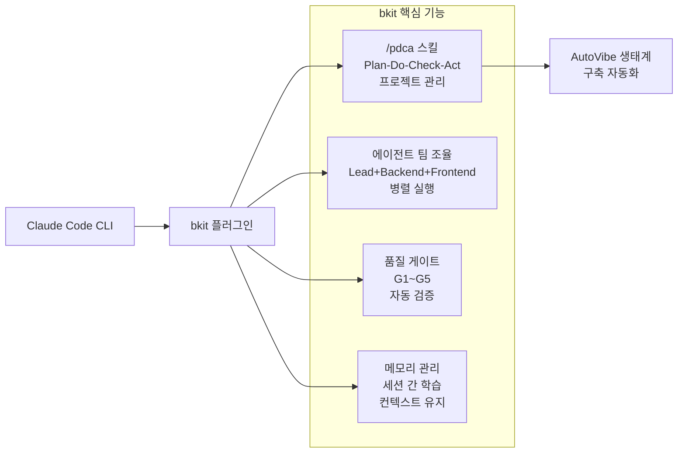
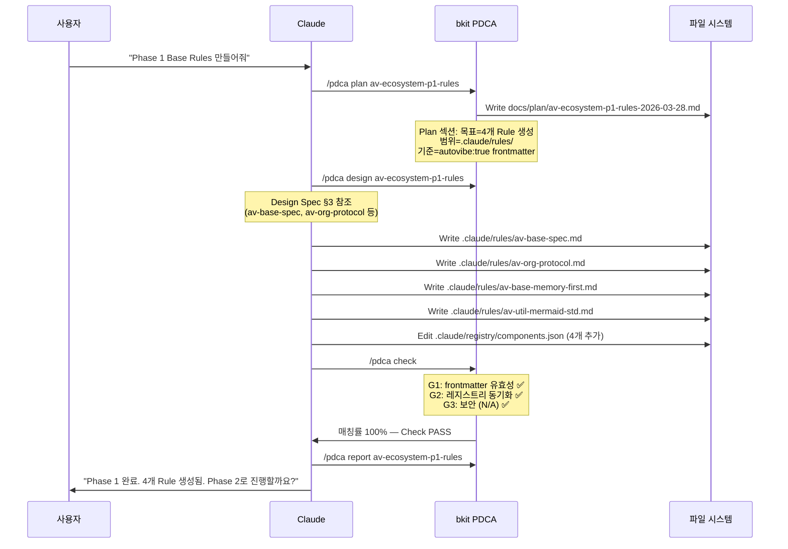
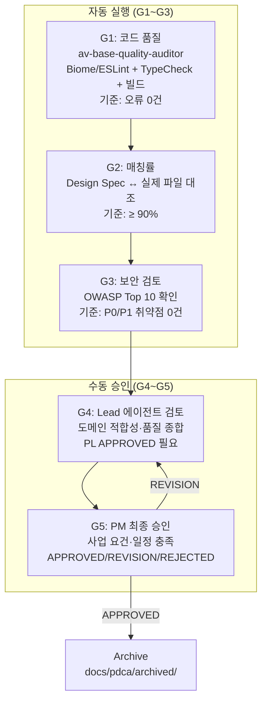
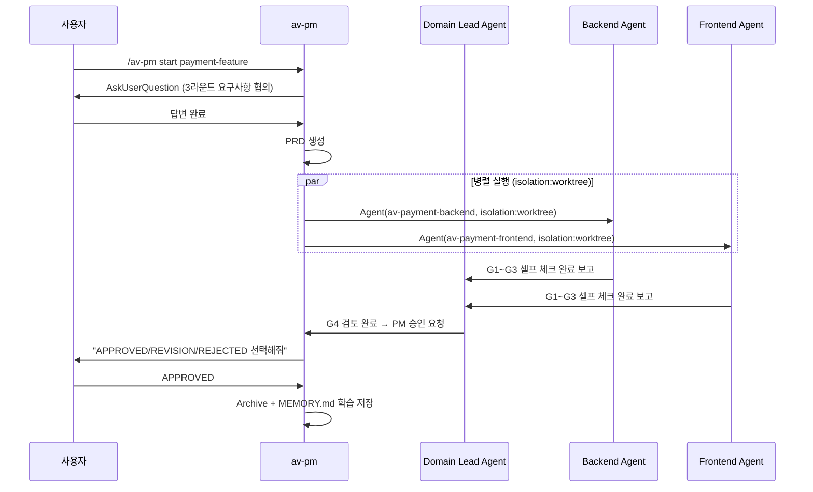
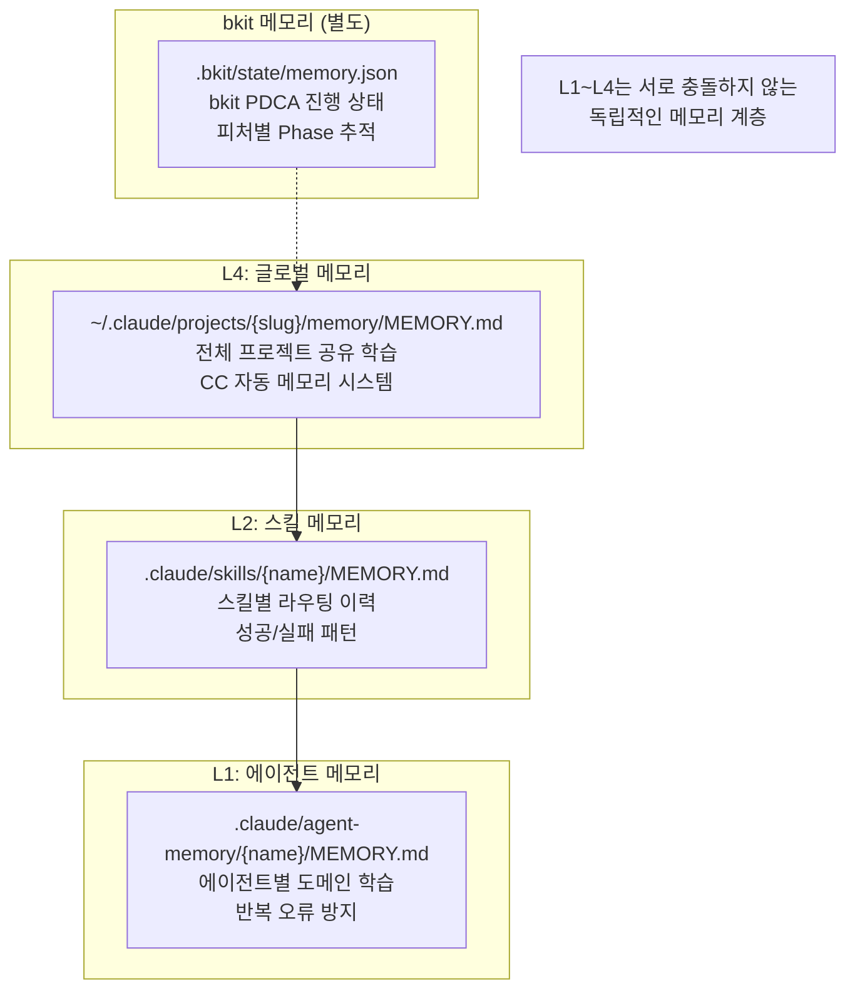

# bkit 플러그인 통합 가이드

> AutoVibe는 bkit 플러그인의 PDCA 스킬을 핵심 엔진으로 사용합니다.
> 이 가이드는 bkit 설치, 설정, AutoVibe와의 연동 방법을 설명합니다.

---

## bkit이란?

bkit(Vibecoding Kit)은 Claude Code용 플러그인으로, AI 네이티브 개발을 위한 도구들을 제공합니다.



---

## 설치 방법

### 방법 1: Claude Code 플러그인 관리자 (권장)

Claude Code 내에서 다음 명령어를 실행합니다:

```
/plugin install bkit
```

### 방법 2: 수동 설치

공식 bkit 문서에서 최신 설치 방법을 확인하세요.

### 설치 확인

```
# Claude Code 내에서 실행
/bkit
```

bkit 메뉴가 표시되면 정상 설치입니다. 이어서 PDCA 스킬을 확인합니다:

```
/pdca status
```

다음과 유사한 대시보드가 표시되어야 합니다:
```
┌─── Workflow Map ─────────────────────────────────┐
│  [PM ·]──→[PLAN ·]──→[DESIGN ·]──→[DO ·]──→[CHECK ·]  │
│  Iter: 0  •  matchRate: N/A                      │
└──────────────────────────────────────────────────┘
```

---

## bkit PDCA 스킬 상세 설명

### PDCA 사이클이란?

**P**lan(계획) → **D**o(실행) → **C**heck(검증) → **A**ct(개선)의 반복 사이클입니다.
AutoVibe는 각 Phase를 하나의 PDCA 사이클로 실행합니다.

```mermaid
flowchart LR
    P["📋 Plan\n목표·범위·기준 수립\n/pdca plan {feature}"]
    D["⚙️ Do\n컴포넌트 구현\n/pdca do"]
    C["✅ Check\nG1~G5 품질 검증\n/pdca check"]
    A["🔄 Act\n개선·학습·Archive\n/pdca report {feature}"]

    P --> D --> C
    C -- "매칭률 < 90%" --> D
    C -- "매칭률 ≥ 90%" --> A
    A -- "다음 Phase" --> P

    style P fill:#2d6a4f
    style C fill:#1d3557
    style A fill:#457b9d
```



### AutoVibe에서 사용하는 bkit 명령어

| 명령어 | AutoVibe 사용 시점 | 설명 |
|--------|----------------|------|
| `/pdca plan {feature}` | 각 Phase 시작 전 | 목표·범위·완료기준 수립 + Plan 문서 생성 |
| `/pdca design {feature}` | Plan 완료 후 | Design Spec 참조한 상세 설계 |
| `/pdca do` | Design 완료 후 | 실제 컴포넌트 파일 생성 |
| `/pdca check` | 구현 완료 후 | G1~G5 품질 게이트 자동 실행 |
| `/pdca report {feature}` | Check ≥ 90% 시 | 완료 보고서 생성 + Archive |
| `/pdca status` | 언제든지 | 현재 진행 상황 확인 |
| `/pdca iterate {feature}` | Check < 90% 시 | 자동 개선 반복 (최대 5회) |

---

## AutoVibe의 PDCA 실행 흐름 (Phase 1 예시)



---

## 품질 게이트 (G1~G5) 상세 설명



> **AutoVibe 초기 구축 시 (Phase 0~5)**: G1~G3 자동 검증만 적용됩니다.
> **Phase 6 도메인 확장 팀 모드**: G4~G5 수동 승인 프로세스도 활성화됩니다.

### AutoVibe 컴포넌트별 G1 기준

| 컴포넌트 유형 | G1 체크 항목 |
|-------------|-----------|
| Rule 파일 | `autovibe: true` frontmatter + `name`, `version`, `created`, `group` 필드 |
| Agent 파일 | frontmatter 필수 필드 + `tools`, `model`, `scope` |
| Skill 파일 | frontmatter 필수 필드 + `argument-hint`, `user-invocable`, `allowed-tools` |
| Hook 스크립트 | 주석 메타데이터 + 실행 권한 + exit 0/2 규칙 |

---

## 팀 모드 (Phase 6 고급 기능)

Phase 6에서 도메인 에이전트를 구축할 때, bkit의 팀 모드를 활용합니다.



**`isolation: "worktree"` 격리 실행의 장점:**
- BE와 FE 에이전트가 동시에 서로 다른 파일을 수정해도 충돌 없음
- 각 에이전트는 독립적인 git worktree에서 작업
- Claude Code v2.1.71+ 필요

---

## 메모리 시스템 구조

bkit과 AutoVibe는 계층적 메모리 시스템으로 세션 간 학습을 유지합니다:



---

## settings.json 설정

bkit 설치 후 AutoVibe는 다음 설정을 `.claude/settings.json`에 추가합니다:

```json
{
  "hooks": {
    "SessionStart": [
      {
        "hooks": [{
          "type": "command",
          "command": "$CLAUDE_PROJECT_DIR/.claude/hooks/av-session-discovery.sh"
        }]
      }
    ],
    "PostToolUse": [
      {
        "matcher": "Write|Edit",
        "hooks": [{
          "type": "command",
          "command": "$CLAUDE_PROJECT_DIR/.claude/hooks/av-post-write-monitor.sh"
        }]
      }
    ],
    "PreToolUse": [
      {
        "matcher": "Bash",
        "hooks": [{
          "type": "command",
          "command": "$CLAUDE_PROJECT_DIR/.claude/hooks/av-bash-guard.sh"
        }]
      }
    ]
  },
  "permissions": {
    "allow": [
      "Bash(chmod +x .claude/hooks/*.sh)",
      "Bash(jq *)",
      "Bash(git log*)",
      "Bash(git status*)"
    ]
  }
}
```

---

## PDCA 문서 저장 위치

```
your-project/
├── docs/
│   └── pdca/
│       ├── active/           ← 진행 중인 PDCA 문서
│       │   └── av-ecosystem-p1-rules-2026-03-28.md
│       └── archived/         ← 완료된 PDCA 문서
│           └── archive/
│               └── 2026-03/
│                   └── av-ecosystem-p1-rules/
│                       └── pdca.md
```

---

## 자주 발생하는 문제 해결

### `/pdca` 명령어를 찾을 수 없는 경우

```
# Claude Code 내에서 재설치
/plugin install bkit

# 또는 세션 재시작 후 확인
/bkit
```

### PDCA 문서가 생성되지 않는 경우

`docs/plan/` 디렉토리가 없으면 먼저 생성하세요:

```bash
mkdir -p docs/plan docs/prd docs/design
```

### 팀 모드에서 에이전트가 실행되지 않는 경우

`isolation: "worktree"` 기능은 Claude Code v2.1.71+ 이상에서 지원됩니다:

```bash
claude --version
# 2.1.71 미만이면 업데이트 필요
claude update
```

### bkit 메모리와 AutoVibe 메모리 충돌

두 메모리 시스템은 독립적입니다. 충돌 없음.
- bkit: `.bkit/state/memory.json` (PDCA 진행 상태)
- AutoVibe: `.claude/agent-memory/*/MEMORY.md` (에이전트 학습)
- CC 자동메모리: `~/.claude/projects/*/memory/MEMORY.md` (글로벌)
