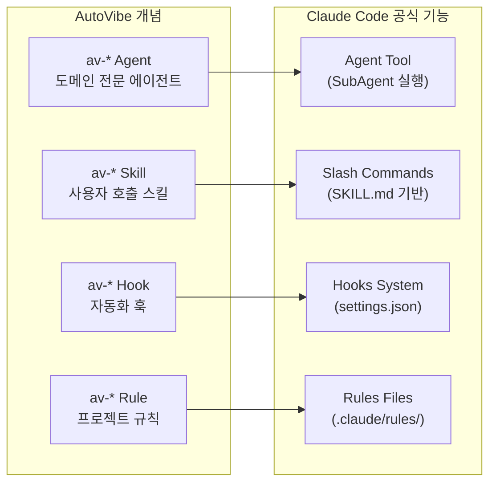
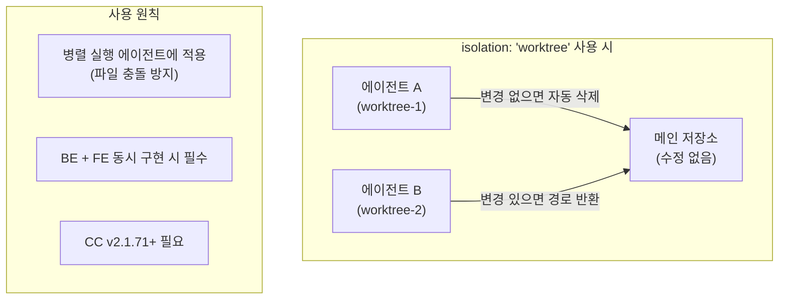
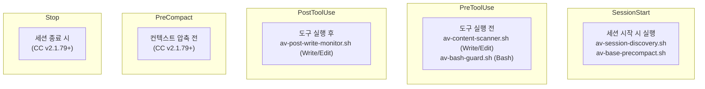
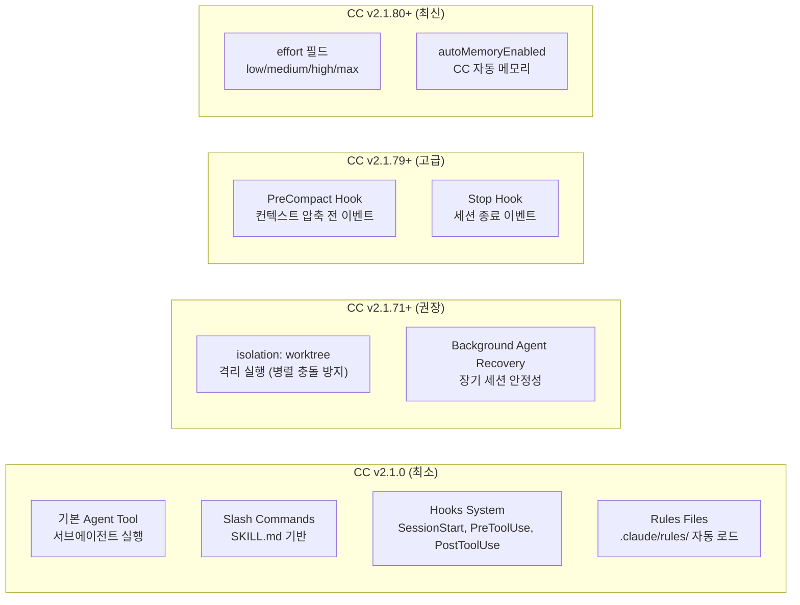
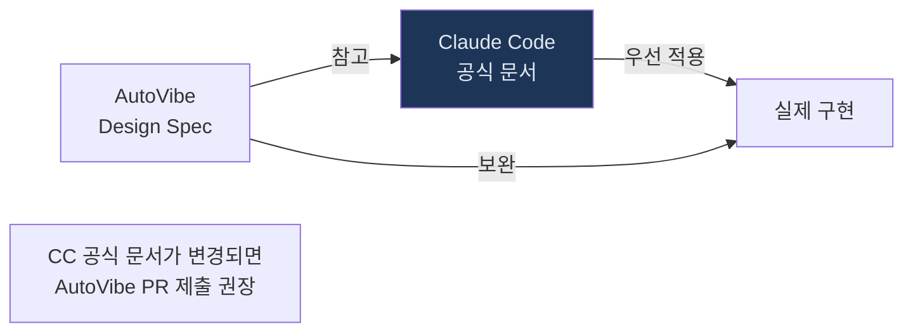

# Claude Code 공식 문서 참조 가이드

> AutoVibe 컴포넌트 구현 시 반드시 Claude Code 최신 공식 문서를 참조하세요.
> 이 가이드는 AutoVibe 개념을 Claude Code 공식 기능에 매핑하는 참조 문서입니다.

---

## 개요: AutoVibe와 Claude Code 기능 매핑



---

## 1. 에이전트 (Agent Tool)

AutoVibe의 `av-*` 에이전트는 Claude Code의 **Agent 도구**를 통해 실행됩니다.

### 공식 에이전트 파일 위치

```
.claude/agents/av-{name}.md
```

> **항상 Claude Code 최신 문서 확인**: `claude docs` 또는 `/help agent`

### 에이전트 Frontmatter 필드 명세 (CC v2.1.81 기준)

```yaml
---
# ─── 필수 필드 ───────────────────────────────────────
name: av-{agent-name}          # av- 접두사 필수 (AutoVibe 규칙)
description: |                 # CC에서 자동완성·설명에 표시
  에이전트 역할 설명 (1~3줄)
  트리거: 언제 호출되는지 명시
tools: [Read, Glob, Grep]      # 이 에이전트가 사용 가능한 도구 목록
model: sonnet                  # sonnet | haiku | opus
scope: ".claude/**"            # 접근 가능한 파일 경로 (glob 패턴)

# ─── AutoVibe 전용 필드 (CC 표준 아님) ───────────────
autovibe: true                 # AutoVibe 생태계 마커
version: "1.0"                 # Major.Minor 문자열
created: "YYYY-MM-DD"
group: base                    # base | vibe | util | {도메인명}

# ─── CC v2.1.80+ 선택 필드 ───────────────────────────
effort: medium                 # low | medium | high | max
isolation: "worktree"          # 격리 실행 (독립적 git worktree)
background: false              # 백그라운드 태스크 실행
---
```

### effort 레벨 가이드

| 레벨 | 사용 시점 | 예시 |
|------|---------|------|
| `low` | 조회·분석 전용 경량 작업 | av-base-optimizer (스캔) |
| `medium` | 일반적인 구현 작업 | av-base-auditor Level 1 |
| `high` | 복잡한 구현 작업 | av-erp-backend 서비스 구현 |
| `max` | 최고 복잡도 (Opus 모델 전용) | 아키텍처 설계 에이전트 |

### isolation: "worktree" 사용 원칙



---

## 2. 스킬 (Slash Commands)

AutoVibe의 `av-*` 스킬은 Claude Code의 **슬래시 명령어** 시스템을 사용합니다.

### 공식 스킬 파일 위치

```
.claude/skills/{skill-name}/SKILL.md
```

### 스킬 Frontmatter 필드 명세 (CC v2.1.81 기준)

```yaml
---
# ─── 필수 필드 ───────────────────────────────────────
name: av-{skill-name}          # 슬래시 명령어 이름 (/av-{skill-name})
description: |                 # /help 및 자동완성에 표시
  스킬 역할 설명
argument-hint: "<subcommand> [args]"  # 사용법 힌트
user-invocable: true           # 사용자가 직접 호출 가능 여부
allowed-tools: [Read, Write, Edit, Glob, Grep, Bash, AskUserQuestion, Task, Agent, Skill]

# ─── AutoVibe 전용 필드 ───────────────────────────────
autovibe: true
version: "1.0"
created: "YYYY-MM-DD"
group: base

# ─── CC 선택 필드 ────────────────────────────────────
effort: medium                 # CC v2.1.80+: 스킬 실행 effort 오버라이드
---
```

### allowed-tools 전체 목록 (CC v2.1.81 기준)

| 도구 | 역할 | 사용 빈도 |
|------|------|---------|
| `Read` | 파일 읽기 | 매우 높음 |
| `Write` | 파일 쓰기 (신규) | 높음 |
| `Edit` | 파일 수정 (기존) | 높음 |
| `Glob` | 파일 패턴 검색 | 높음 |
| `Grep` | 파일 내용 검색 | 높음 |
| `Bash` | 셸 명령어 실행 | 중간 |
| `AskUserQuestion` | 사용자 질문 | 높음 |
| `Task` | 에이전트 실행 (내부) | 중간 |
| `Agent` | 에이전트 실행 (공개) | 높음 |
| `Skill` | 다른 스킬 호출 | 중간 |
| `WebFetch` | 웹 페이지 가져오기 | 낮음 |
| `WebSearch` | 웹 검색 | 낮음 |

> **주의**: `allowed-tools` 목록은 CC 버전에 따라 달라질 수 있습니다.
> 항상 `claude docs` 또는 `/help tools`로 최신 목록을 확인하세요.

---

## 3. 훅 (Hooks System)

AutoVibe의 훅은 Claude Code의 **Hooks 시스템**을 사용합니다.

### hooks 이벤트 전체 목록 (CC v2.1.81 기준)



| 이벤트 | 트리거 | AutoVibe 활용 |
|--------|--------|-------------|
| `SessionStart` | Claude Code 세션 시작 | 생태계 컨텍스트 로드, 메모리 초기화 |
| `PreToolUse` | 도구 실행 전 (matcher 지정) | 내용 검사, 위험 명령어 차단 |
| `PostToolUse` | 도구 실행 후 (matcher 지정) | 변경 감지, 이력 로깅 |
| `PreCompact` | 컨텍스트 압축 전 | 중요 메모리 저장 |
| `Stop` | 세션 종료 | 학습 내용 MEMORY.md 저장 |

### 훅 스크립트 exit 코드 규칙

```bash
exit 0   # 성공 — 도구 실행 계속
exit 1   # 경고 — 도구 실행 계속 (메시지 출력)
exit 2   # 차단 — 도구 실행 중단 (PreToolUse에서만 유효)
```

### settings.json 훅 등록 형식

```json
{
  "hooks": {
    "{이벤트명}": [
      {
        "matcher": "{도구명 패턴}",  // PreToolUse/PostToolUse 전용
        "hooks": [
          {
            "type": "command",
            "command": "$CLAUDE_PROJECT_DIR/.claude/hooks/{script}.sh"
          }
        ]
      }
    ]
  }
}
```

---

## 4. 규칙 (Rules Files)

AutoVibe의 규칙 파일은 Claude Code의 **Rules 파일**로 자동 로드됩니다.

### 공식 규칙 파일 위치

```
.claude/rules/{rule-name}.md
```

### 규칙 Frontmatter 필드 명세

```yaml
---
# ─── 필수 필드 ───────────────────────────────────────
name: av-{rule-name}
autovibe: true              # AutoVibe 마커
version: "1.0"
created: "YYYY-MM-DD"
group: base

# paths: 이 규칙이 적용되는 파일 경로 (적용 범위 제한)
paths:
  - ".claude/**"            # .claude/ 하위 모든 파일에 적용
  - "src/**/*.ts"           # TypeScript 파일에 적용
---
```

> **규칙 파일의 특성**: `.claude/rules/` 의 모든 파일은 Claude Code가 세션 시작 시 자동으로 로드합니다.
> 사용자 지시사항으로 처리되어 모든 대화에서 유효합니다.

---

## 5. 버전 호환성 매트릭스



| AutoVibe Phase | 최소 CC 버전 | 이유 |
|----------------|:-----------:|------|
| Phase 0~5 (기본 구축) | v2.1.0 | Agent + Hooks + Rules 기본 기능 |
| Phase 6 (팀 모드 병렬) | **v2.1.71** | `isolation: "worktree"` 필요 |
| PreCompact/Stop 훅 | v2.1.79 | 신규 hook 이벤트 |
| effort 레벨 최적화 | v2.1.80 | `effort` frontmatter 필드 |

---

## 6. 최신 Claude Code 문서 참조 방법

AutoVibe 컴포넌트를 구현하기 전, 항상 최신 CC 문서를 확인하세요.

### Claude Code 내 도움말

```bash
/help                    # 전체 명령어 목록
/help tools              # 사용 가능한 도구 목록
/help agent              # 에이전트 실행 방법
/help hooks              # 훅 시스템 설명
claude --version         # 현재 버전 확인
claude update            # 최신 버전으로 업데이트
```

### AutoVibe 업데이트 기여

새 CC 버전 릴리즈 시 AutoVibe Design Spec을 업데이트할 영역:

| 섹션 | 파일 | 업데이트 항목 |
|------|------|------------|
| 에이전트 Frontmatter | `docs/design/av-ecosystem-design-spec.md §4` | 신규 frontmatter 필드 |
| 스킬 Frontmatter | `docs/design/av-ecosystem-design-spec.md §5` | allowed-tools 목록 |
| 훅 이벤트 | `docs/design/av-ecosystem-design-spec.md §6` | 신규 hook 이벤트 |
| 버전 매트릭스 | 이 문서 §5 | 호환성 테이블 |

---

## 7. 중요 원칙: CC 공식 문서 우선

AutoVibe Design Spec과 CC 공식 문서가 충돌하는 경우, **CC 공식 문서가 항상 우선**합니다.



**버전별 주요 변경사항 추적 방법:**

```bash
# CC 업데이트 후 변경사항 확인
claude update
claude --version

# Release notes 확인 (CC 내)
/help changelog
```

---

## 8. 공식 문서 링크

> **주의**: URL은 변경될 수 있습니다. Claude Code 내 `/help` 명령어를 우선 사용하세요.

| 리소스 | 접근 방법 |
|--------|---------|
| Claude Code 공식 문서 | `claude docs` (터미널) |
| 에이전트 도구 명세 | `/help agent` (Claude Code 내) |
| 훅 시스템 명세 | `/help hooks` (Claude Code 내) |
| 슬래시 명령어 명세 | `/help skills` (Claude Code 내) |
| 권한(Permission) 설정 | `/help permissions` (Claude Code 내) |
| MCP 서버 설정 | `.mcp.json` 형식 문서 |
