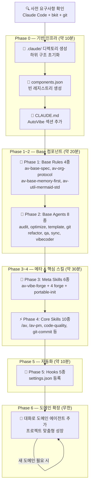
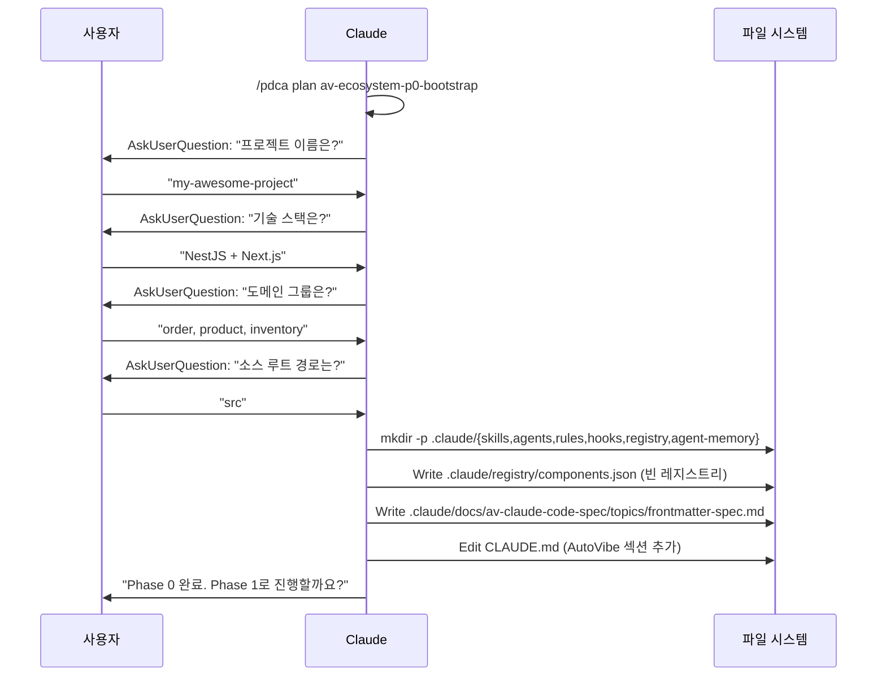
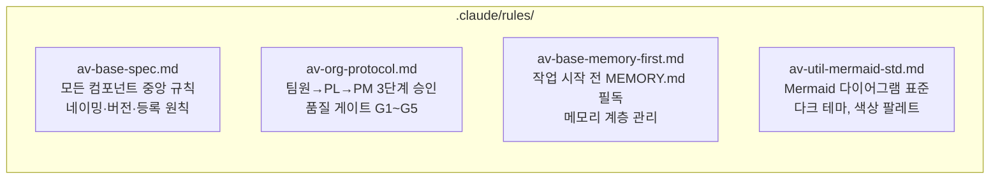
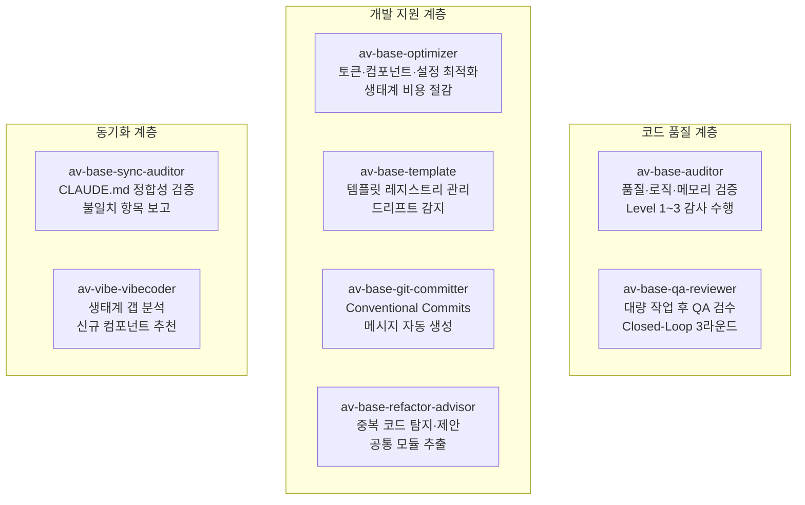
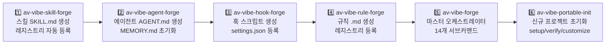
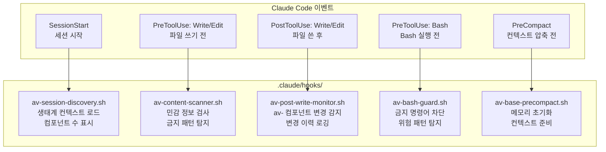

# AutoVibe 시작 가이드

> PDCA 대화를 통해 6개 Phase로 AI 에이전트 생태계를 구축합니다.
> 이 가이드는 Phase 0부터 Phase 5까지 단계별로 진행하는 방법을 설명합니다.

**처음 시작하신다면**: [guides/quick-start-30min.md](quick-start-30min.md) — 30분 타임라인 가이드
**컴포넌트 이름이 궁금하다면**: [guides/naming-guide.md](naming-guide.md) — 네이밍 완전 가이드
**Phase GO/NO-GO 기준이 궁금하다면**: [guides/phase-progression.md](phase-progression.md)

---

## 표준 Claude 프롬프트 패턴

모든 Phase는 다음 형식으로 시작합니다:

```
Phase {N}을 시작해줘.
```

Claude가 AskUserQuestion으로 필요한 정보(기술 스택, 도메인 등)를 자동으로 수집합니다.
추가 옵션이 있을 때만 지정하면 됩니다:

```
Phase 2를 시작해줘. 기술 스택은 FastAPI + React야.
Phase 4를 시작해줘. 도메인은 user, order, payment야.
Phase 5를 시작해줘. rm -rf와 DROP TABLE은 금지해줘.
```

---

## 전체 흐름 개요



---

## 사전 요구사항

### 필수 도구 설치 확인

```bash
# 1. Claude Code 버전 확인 (v2.1.71 이상 필요)
claude --version

# 2. git 확인
git --version

# 3. 프로젝트 디렉토리 준비
mkdir my-project && cd my-project
git init
```

### bkit 플러그인 설치

bkit은 AutoVibe의 PDCA 사이클을 구동하는 핵심 플러그인입니다.
설치 방법은 [bkit-integration.md](bkit-integration.md)를 참조하세요.

설치 확인:
```
# Claude Code 내에서 실행
/bkit
```

`bkit` 메뉴가 나타나면 정상 설치된 것입니다.

### AutoVibe 문서 복사

```bash
# AutoVibe 저장소 클론
git clone https://github.com/s99606931/autovibe.git /tmp/autovibe

# 내 프로젝트에 문서 복사
mkdir -p docs/autovibe
cp -r /tmp/autovibe/docs/* docs/autovibe/
```

복사 후 구조:
```
my-project/
├── docs/
│   └── autovibe/
│       ├── prd/av-ecosystem-pdca-driven.prd.md
│       ├── plan/av-ecosystem-pdca-driven-*.md
│       └── design/av-ecosystem-design-spec.md
└── .git/
```

---

## Phase 0: 기반 인프라 구축

> **목표**: `.claude/` 디렉토리 구조와 빈 레지스트리, CLAUDE.md AutoVibe 섹션을 생성합니다.

### Claude Code 실행

```bash
cd my-project
claude
```

### Claude에게 다음과 같이 말하세요

```
AutoVibe 생태계를 구축하고 싶어. Phase 0부터 시작해줘.
```

Claude가 자동으로 Design Spec을 참조하여 단계를 진행합니다. 처음 실행 시 4가지 질문에 답해주세요:
- 프로젝트 이름 (예: `my-saas`)
- 기술 스택 (예: `NestJS + Next.js`)
- 도메인 그룹 (예: `user, order, payment`)
- 소스 루트 경로 (기본값 `src` 그대로 Enter 가능)

### Claude가 하는 일 (내부 동작)



### Phase 0 완료 후 생성되는 구조

```
.claude/
├── skills/           ← 스킬 파일 (SKILL.md) 저장 위치
├── agents/           ← 에이전트 파일 (AGENT.md) 저장 위치
├── rules/            ← 규칙 파일 (.md) 저장 위치
├── hooks/            ← 훅 셸 스크립트 저장 위치
├── registry/
│   └── components.json   ← 빈 레지스트리 (곧 채워집니다)
├── agent-memory/     ← 에이전트별 MEMORY.md 저장 위치
└── docs/
    └── av-claude-code-spec/topics/
        └── frontmatter-spec.md   ← 컴포넌트 형식 명세
```

---

## Phase 1: Base Rules 생성

> **목표**: av 생태계의 핵심 동작 규칙 4종을 생성합니다.
> 이 규칙들은 모든 에이전트/스킬에 자동으로 적용됩니다.

### Claude에게 말하기

```
Phase 1을 시작해줘.
```

### 생성되는 Rules



| Rule | 역할 | 적용 범위 |
|------|------|---------|
| `av-base-spec` | AutoVibe 중앙 규칙 인덱스 — 네이밍, 버전, 등록 원칙 | 모든 컴포넌트 |
| `av-org-protocol` | 팀 협업 프로토콜 — 보고체계, 승인절차, PDCA 의무 | 팀 작업 시 |
| `av-base-memory-first` | 메모리 우선 원칙 — 작업 전 MEMORY.md 반드시 읽기 | 모든 에이전트 |
| `av-util-mermaid-std` | Mermaid 다이어그램 표준 — 테마, 색상, 검증 방법 | 문서 작성 시 |

---

## Phase 2: Base Agents 생성

> **목표**: 어떤 프로젝트에서나 반드시 필요한 범용 에이전트 8종을 생성합니다.

### Claude에게 말하기

```
Phase 2를 시작해줘.
```

기술 스택이 Phase 0에서 이미 설정되었다면 Claude가 자동으로 적용합니다.
스택을 변경하고 싶다면: `Phase 2를 시작해줘. 기술 스택은 FastAPI + React야.`

### 생성되는 Agents



각 에이전트와 함께 MEMORY.md가 자동 생성됩니다:
```
.claude/agent-memory/
├── av-base-auditor/MEMORY.md      ← 감사 이력 학습
├── av-base-optimizer/MEMORY.md   ← 최적화 패턴 학습
└── ... (8개 모두)
```

---

## Phase 3: Meta Skills (Forge) 생성

> **목표**: av 생태계를 스스로 확장할 수 있는 생성 도구(Forge) 6종을 만듭니다.
> 이 Phase 완료 후부터 `/av-vibe-forge` 명령어로 새 컴포넌트를 쉽게 생성할 수 있습니다.

### Claude에게 말하기

```
Phase 3을 시작해줘.
```

### 생성 순서 (의존성 고려)



**Phase 3 완료 후 사용 가능한 명령어:**
```bash
/av-vibe-forge skill my-skill     # 새 스킬 생성
/av-vibe-forge agent my-agent     # 새 에이전트 생성
/av-vibe-forge hook PostToolUse my-hook  # 훅 생성
/av-vibe-forge rule my-rule       # 규칙 생성
/av-vibe-forge health             # 생태계 건강도 확인
```

---

## Phase 4: Core Skills 생성

> **목표**: 일상 개발 워크플로우를 자동화하는 핵심 스킬 10종을 생성합니다.

### Claude에게 말하기

```
Phase 4를 시작해줘.
```

ROUTING_TABLE을 직접 지정하고 싶다면: `Phase 4를 시작해줘. 도메인은 user, order, payment야.`

### 생성되는 Core Skills

| 스킬 | 명령어 | 역할 |
|------|--------|------|
| **av** | `/av {자연어}` | 자연어 → 최적 컴포넌트 자동 라우팅 |
| **av-pm** | `/av-pm start {feature}` | PM 대화 → PRD → 팀 구성 |
| **av-base-code-quality** | `/av-base-code-quality` | lint + typecheck + build 순차 실행 |
| **av-base-git-commit** | `/av-base-git-commit` | Conventional Commits 메시지 자동 생성 |
| **av-base-sync** | `/av-base-sync` | CLAUDE.md 코드베이스 동기화 |
| **av-base-refactor** | `/av-base-refactor` | 중복 코드 탐지·리팩토링 계획 |
| **av-base-post-qa** | `/av-base-post-qa` | 대량 작업 후 QA 오케스트레이션 |
| **av-ecosystem-optimizer** | `/av-ecosystem-optimizer` | 생태계 토큰·컴포넌트 최적화 |
| **av-agent-chat** | `/av-agent-chat` | 에이전트와 자연어 대화 |
| **av-docs-guard** | `/av-docs-guard scan` | 문서 디렉토리 무결성 감시 |

### ROUTING_TABLE 커스터마이즈 (av/SKILL.md)

기본 ROUTING_TABLE에 프로젝트 도메인 경로를 추가해야 합니다:

```
# 기본 경로 (모든 프로젝트 공통)
creation + any → /av-vibe-forge skill {name}
analysis + code → av-base-auditor Level 2
configuration + git → /av-base-git-commit

# 추가할 도메인 경로 (예시: 이커머스)
ecom + backend/api → av-ecom-order-backend
ecom + frontend → av-ecom-order-frontend
payment + any → av-payment-lead
```

---

## Phase 5: Hooks & Settings 등록

> **목표**: Claude Code 이벤트에 연결된 자동화 훅 5종을 생성하고 settings.json에 등록합니다.

### Claude에게 말하기

```
Phase 5를 시작해줘.
```

금지할 Bash 명령어 패턴이 있다면: `Phase 5를 시작해줘. rm -rf와 DROP TABLE은 금지해줘.`

### 생성되는 Hooks와 동작 시점



### settings.json 등록 확인

```bash
cat .claude/settings.json | jq '.hooks | keys'
# 기대 출력: ["PostToolUse", "PreToolUse", "SessionStart"]

ls -la .claude/hooks/
# 5개 .sh 파일 + 실행 권한(x) 확인
```

---

## 완성 검증

### 생태계 건강도 확인

```
/av-vibe-forge health
```

예상 출력:
```
════════════════════════════════════════
  AutoVibe 생태계 건강도: 95/100
════════════════════════════════════════
  ✅ OK: 33개 컴포넌트
  ⚠️ STALE: 0개
  ❌ MISSING: 0개
────────────────────────────────────────
  등록 현황:
    Rules  4개 | Agents  8개
    Skills 16개 | Hooks   5개
════════════════════════════════════════
```

### 게이트웨이 동작 확인

```
/av run "코드 품질 검사해줘"
# 기대: av-base-auditor Level 2 실행

/av-pm start test-feature
# 기대: AskUserQuestion 3라운드 시작
```

---

## Phase 6: 도메인 확장 (진행형)

> 기반 생태계 구축 후, 대화로 프로젝트 특화 컴포넌트를 계속 추가합니다.

### 도메인 에이전트 추가 방법

```
사용자: "결제 도메인 전담 에이전트가 필요해"

Claude 내부 실행:
  /av-pm start payment-agents
  → AskUserQuestion (결제 도메인 범위, 스택, 완료 기준)
  → PRD 생성: docs/prd/payment-agents.prd.md

  /av-vibe-forge agent payment-lead --group payment
  → .claude/agents/av-payment-lead.md 생성
  → .claude/agent-memory/av-payment-lead/MEMORY.md 초기화

  /av-vibe-forge agent payment-backend --group payment
  → .claude/agents/av-payment-backend.md 생성

  /av-vibe-forge skill payment-impl --group payment
  → .claude/skills/av-payment-impl/SKILL.md 생성

  ROUTING_TABLE 업데이트:
    payment + backend/api → av-payment-backend
    payment + any → av-payment-lead

결과: /av run "결제 취소 API 구현" → av-payment-backend 자동 라우팅
```

---

## 주요 명령어 참조

| 명령어 | 설명 | 사용 시점 |
|--------|------|---------|
| `/av {자연어}` | 지능형 라우팅 게이트웨이 | 항상 |
| `/av-pm start {feature}` | PM 대화로 새 기능 시작 | 새 기능 개발 시 |
| `/av-vibe-forge health` | 생태계 건강도 0~100점 | 주기적 점검 |
| `/av-vibe-forge skill {name}` | 새 스킬 생성 | Phase 6 확장 |
| `/av-vibe-forge agent {name}` | 새 에이전트 생성 | Phase 6 확장 |
| `/av-vibe-forge list` | 전체 컴포넌트 목록 | 현황 파악 |
| `/av-base-code-quality` | 코드 품질 검사 | PR 전 |
| `/av-base-git-commit` | 커밋 메시지 자동 생성 | 커밋 시 |
| `/av-base-sync` | CLAUDE.md 최신화 | 코드 변경 후 |
| `/av-ecosystem-optimizer` | 생태계 최적화 | 월 1회 |

---

## 자주 발생하는 문제 해결

### `.claude/` 디렉토리가 생성되지 않는 경우

Claude Code가 프로젝트 루트에서 실행되고 있는지 확인하세요:
```bash
pwd  # 프로젝트 루트여야 함
ls   # CLAUDE.md 또는 .git/ 확인
claude
```

### bkit PDCA 스킬을 찾을 수 없는 경우

[bkit-integration.md](bkit-integration.md)를 참고하여 플러그인을 재설치하거나 Claude Code 세션을 재시작하세요.

### Phase가 중간에 실패한 경우

현재 진행 상황을 확인하고 해당 Phase부터 재시작하세요:
```
/pdca status
```

실패한 Phase만 재시작:
```
Phase {N} {단계명}을 다시 실행해줘. Design Spec §{섹션} 참고해서.
```

### components.json이 업데이트되지 않는 경우

컴포넌트를 수동으로 생성한 경우 레지스트리 동기화를 요청하세요:
```
.claude/ 폴더를 스캔해서 components.json 레지스트리를 최신화해줘.
```

### 생태계 건강도가 낮은 경우 (70점 미만)

```
/av-vibe-forge health
# MISSING 항목 확인 → 해당 컴포넌트 재생성

/av-vibe-forge validate
# 파일 무결성 검증 → 오류 수정
```
